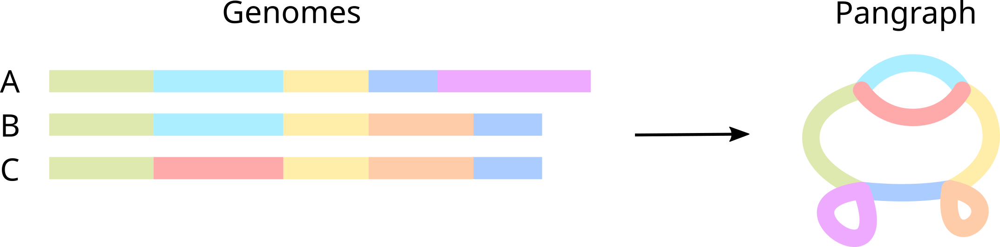
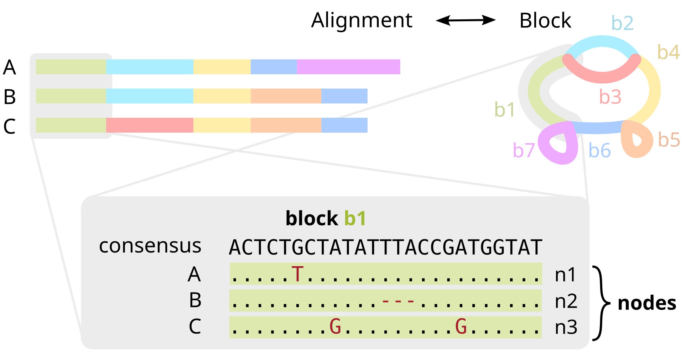
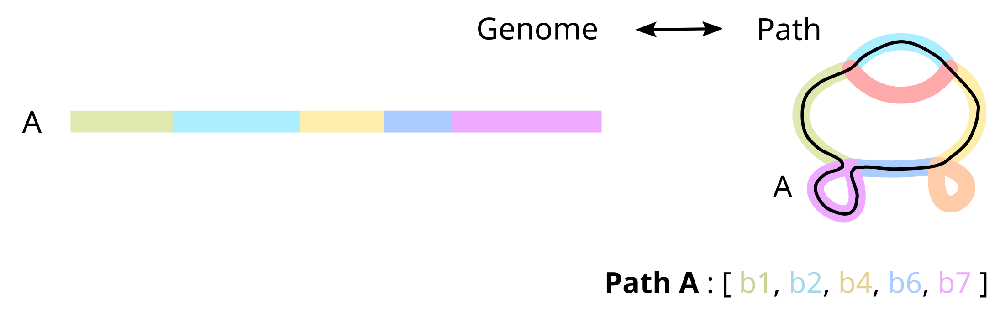

# Glossary

This section describes terms and concepts used in the pangraph codebase, issues, documentation, etc.

The terminology in bioinformatics is often ambiguous, with some terms not being defined well and some terms having different meaning, depending on context and research area.

In order to improve understanding of this documentation and of the source code of the project, in this section we try to summarize the terminology used by Pangraph, including possible synonyms. This terminology is not perfect or complete, and some of the definitions are purposefully simplified, to narrow down the scope to the topics relevant for the project.

#### Pangraph

A collection of _blocks_, associated to all recognized intervals of homology, and _paths_, genomes stored as an ordered walk of _nodes_.

#### Block / Pancontig

A contiguous interval of sequence that compresses a linear multiple sequence alignment and represents a single vertex within a pangraph.
It is summarized by a consensus sequence, along with the polymorphisms needed for each genome to reconstruct the true sequence.

#### Path

A sequence of _nodes_ that represent an ordered walk on the graph that reconstructs an input genome.
Can be circular or linear.

#### Node

An oriented traversal of a genome through a _block_, i.e. whether a given genome/duplication traverses a block along the forward or reverse direction.
One genome can have multiple nodes that point to the same _block_.
