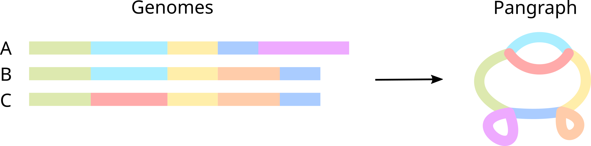

# Introduction to Pangraph

:::danger[Under construction 👷]

Pangraph is currently under heavy development. Bugs and crashes are to be expected.

:::

Microbes don't evolve strictly by vertical descent and modification; in addition, there is persistent lateral exchange of genetic material within their local spatial neighborhood.
At the present, explanatory population genetic models exist at both extrema of limits horizontal transfer rate; researchers have a reasonable, quantitative understanding of both asexual and the fully decoupled, single-site, evolution.
However, there are currently no satisfactory models, and thus computational tools, in the more realistic intermediate regime, let alone that models which account for _any_ structural variation within a population.
In order to investigate such questions empirically in natural populations, we have developed a scalable multiple genome alignment tool, **PanGraph**, that identifies regions of mutual homology between large sets of closely related genomes.
This is expected to be useful to parsimoniously infer horizontal gene transfer events within a community; perform comparative studies of genome gain, loss, and rearrangement dynamics; or simply to compress many related genomes.

**PanGraph** (short for pangenome graph) builds a graph-based coordinate system for polymorphic variation in a microbial population that generalizes classical linear alignment techniques.
The graph is built by progressively aligning pairs of genomes using Minimap2's minimizer-based algorithm, and thus simultaneously aligns all genomes within the population in linear time.
The resultant graph represents contiguous intervals of homologous DNA as vertices and every genome as an ordered walk across such vertices.
Edges of the graph are unordered and only exist if at least one genome was found to connect both vertices in either the forward or reverse strand.
The documentation, and source code, uses the following terminology:

1. **Block/PanContig:**
    A contiguous interval of sequence that compresses a linear multiple sequence alignment and represents a single vertex within a pangraph.
    It is summarized by a consensus sequence, along with the polymorphisms needed for each genome to reconstruct the true sequence.
2. **Node:**
    An oriented traversal of a genome through a _block_, i.e. whether a given genome/duplication traverses a block along the forward or reverse direction.
    One genome can have multiple nodes that point to the same _block_.
1. **Path:**
    A sequence of _nodes_ that represent an ordered walk on the graph that reconstructs an input genome.
    Can be circular or linear.
2. **Graph/PanGraph:**
    A collection of _blocks_, associated to all recognized intervals of homology, and _paths_, genomes stored as an ordered walk of _nodes_.

For a more detailed description see [what is a pangraph](http://localhost:4000/tutorial/tutorial_1#what-is-a-pangraph).