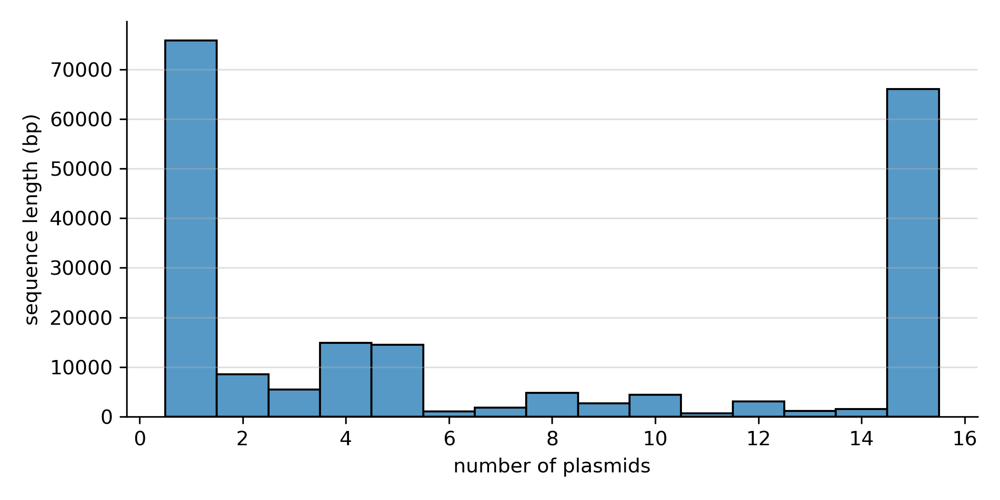
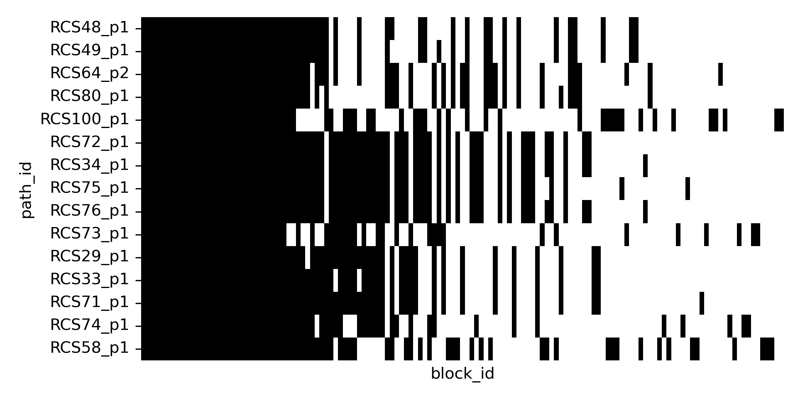
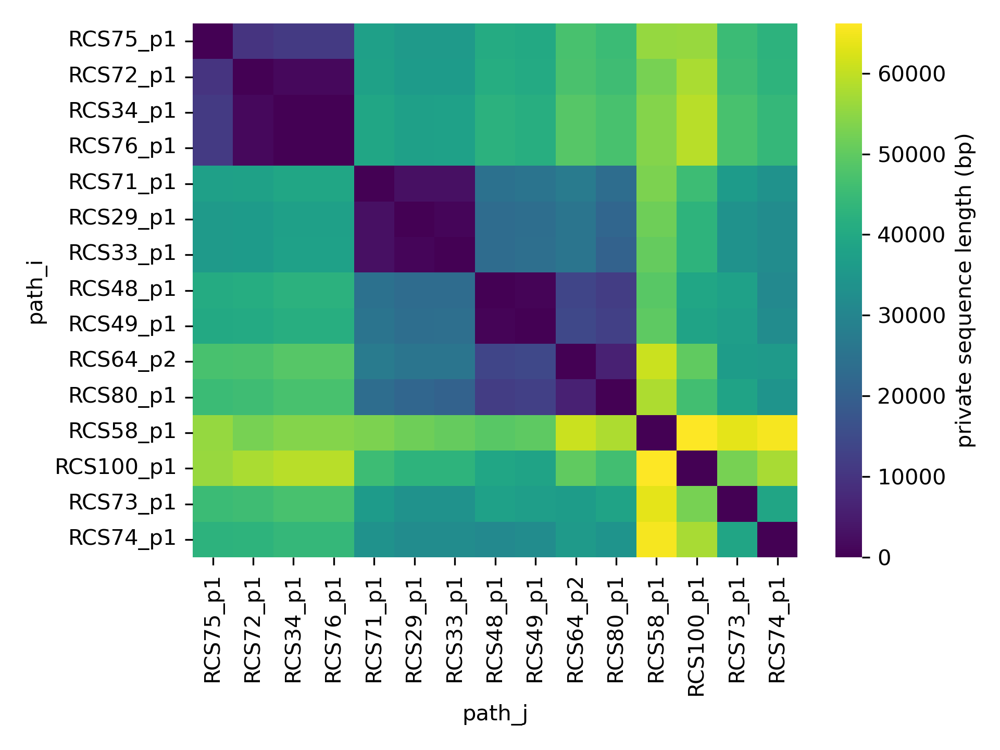
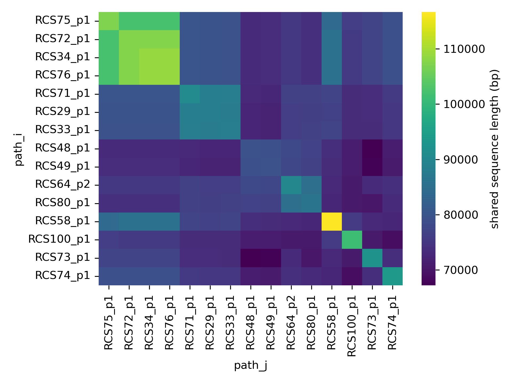

# A look at the pangenome

In this next section of the tutorial we use some of the features of PyPangraph to explore the blocks that make up the pangenome graph, and extract information on the pangenome of our dataset.

## Block sizes and counts

PyPangraph provides functions to easily compute statistics on the blocks.

```python
stats_df = graph.to_blockstats_df()
# block_id              count  n_strains  duplicated   core   len
# 124231456905500231       15         15       False   True  2202
# 149501466629434994        2          2       False  False   210
# 279570196774736738        2          2       False  False  1308
# ...                     ...        ...         ...    ...   ...
# [137 rows x 5 columns]
```

This dataframe contains the following columns:

- `block_id`: the block identifier
- `count`: the number of times the block appears in the input genomes (including duplicates)
- `n_strains`: the number of different paths that contain the block (does not include duplicates)
- `duplicated`: whether the block appears more than once in any path
- `core`: whether the block is present exactly once in all paths
- `len`: the length of the block in base pairs

This information can be used to answer several questions such as:

<details>
    <summary>what is the longest core block?</summary>

    The block with the highest copy number can be retrieved with:

    ```python
    stats_df[stats_df.core].sort_values("len", ascending=False).head(1)
    # block_id             count  n_strains  duplicated  core  len
    # 5109347125394127434     15         15       False  True  9041
    ```

    This block occurs 30 times in 15 paths. Its nucleotide sequence is given by:

    ```python
    block = graph.blocks[5109347125394127434]
    print(block.consensus())
    # ACGCCAGCATCCGCATCATTAAACGGAGGCATGCCTGTTTCCGA...
    ```

    A [nucleotide blast](https://blast.ncbi.nlm.nih.gov/Blast.cgi) search of this sequence shows that it contains several genes involved in plasmid conjugation.
</details>


<details>
    <summary>what is the total pangenome and core genome size?</summary>

    The total pangenome size is the sum of the lengths of all blocks:

    ```python
    stats_df["len"].sum()
    # 206'535 bp
    ```

    The core genome size is the sum of the lengths of all core blocks:

    ```python
    stats_df[stats_df.core]["len"].sum()
    # 64'989 bp
    ```

</details>


## Pangenome frequency

From this dataframe we can also compute the pangenome frequency distribution of our dataset, i.e. the distribution of the number of blocks that are present in a given number of strains.

```python
import seaborn as sns

sns.histplot(stats_df, x="n_strains", weights="len", discrete=True)
```



A high fraction of the pangenome (~70kbp) is composed of singleton blocks, i.e. blocks that are present in only one path/plasmid. An equally large fraction (~65 kbp) is core, i.e. present in all paths.

## Block presence-absence

Pypangraph also provides a function to get the number of block copies in each path.

```python
bl_count = graph.to_blockcount_df()
print(bl_count)
#         path_id       RCS48_p1  RCS49_p1  RCS64_p2  RCS80_p1  ...
# block_id
# 124231456905500231           1         1         1         1  ...
# 149501466629434994           0         0         0         0  ...
# 853681554159741190           1         1         1         1  ...
# ...                        ...       ...       ...       ...  ...
```

This dataframe can be used to visualize the presence-absence of blocks in the dataset.

```python
# block presence-absence matrix
block_PA = bl_count > 0

# order blocks by frequency
bl_order = block_PA.sum(axis=1).sort_values(ascending=False).index

# plot presence-absence matrix
sns.heatmap(block_PA.loc[bl_order].T)
```



Blocks with intermediate frequency indicate substructure in the datasets with some subgroups of plasmids sharing certain blocks. To better quantify this similarity we can look at different pairs of genomes.

## Similarity in accessory genome content

With these dataframes we can also answer the following questions: how similar are any two genomes in their accessory genome content?

For any pair of genomes, we can quantify diversity in accessory content both as amount of **shared pangenome** and amount of **private pangenome**, i.e. total size of blocks present in both genomes, and total size of blocks present in only one of the two genomes.


Pypangraph provides a convenient function to compute these quantities:

```python
pw_comp = graph.pairwise_accessory_genome_comparison()
#                     shared   diff
# path_i   path_j
# RCS48_p1 RCS48_p1    79580      0
#          RCS49_p1    79249    689
#          RCS64_p2    78061  13548
# ...                    ...    ...
```

We can easily obtain a distance matrix from this dataframe:

```python
# distance matrix
D = pw_comp["diff"].unstack()

order = ['RCS75_p1', 'RCS72_p1', 'RCS34_p1', 'RCS76_p1', 'RCS71_p1', 'RCS29_p1', 'RCS33_p1', 'RCS48_p1', 'RCS49_p1', 'RCS64_p2', 'RCS80_p1', 'RCS58_p1', 'RCS100_p1', 'RCS73_p1', 'RCS74_p1']
sns.heatmap(D.loc[order, order])
```



The optimal ordering of the genomes was determined with hierarchical clustering of the distance matrix, as explained below.

To better visualize the similarity between genomes, we can use hierarchical clustering to reorder the distance matrix.

This can easily be done with the `scipy.cluster.hierarchy` module:

```python
import scipy.cluster.hierarchy as sch

# Perform hierarchical clustering
linkage_matrix = sch.linkage(dist_df, method="ward")
ordered_indices = sch.leaves_list(linkage_matrix)
order = dist_df.index[ordered_indices]
```

This matrix shows that there are plasmid clusters that have little within-cluster accessory genome, while plasmids from different clusters show several tens of kbps of accessory genome differences.

In the same way we can also visualize the amount of shared pangenome:

```python
S = pw_comp["shared"].unstack()
sns.heatmap(S.loc[order, order])
```



Plasmids from our datasets have sizes varying between 80 and 120 kbp. All plasmids share a backbone of ~70 kbp, with higher sharing between plasmids from the same clade.
