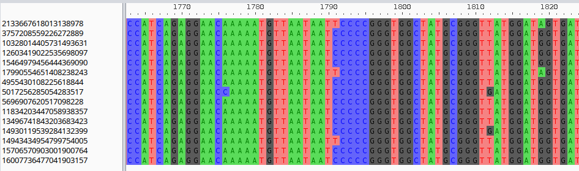
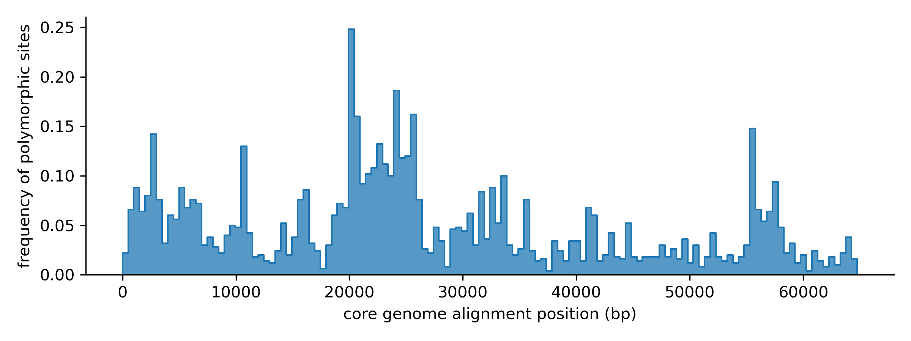
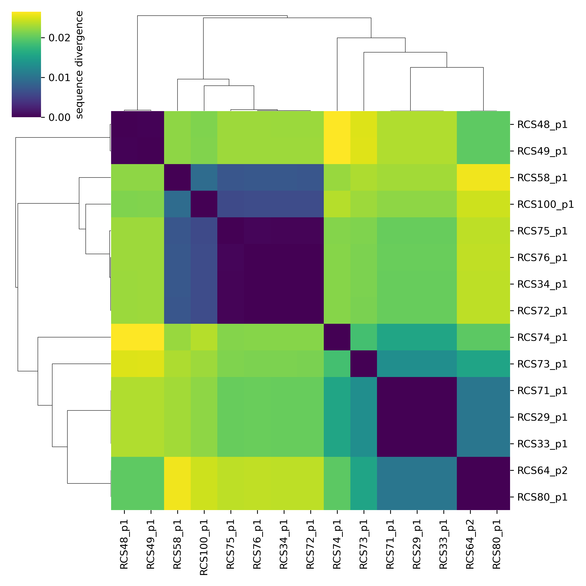
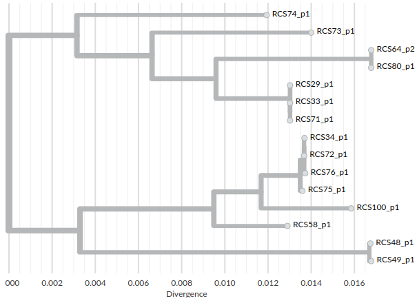

# Exploring block alignments

In this next tutorial section we explore block alignments in more detail.

## extracting block alignments

Let's consider a core block from our graph:

```python
block_stats = graph.to_blockstats_df()
print(block_stats[block_stats.core])
# block_id              count  n_strains  duplicated  core   len        
# ...                                
# 1745536582941762917      15         15       False  True  2932
# ...
block = graph.blocks[1745536582941762917]
```

The block can be exported as a biopython alignment object:

```python
aln = block.to_biopython_alignment()
print(aln)
# Alignment with 15 rows and 2932 columns
# TTCTGCAATTGAGTCTTGTATGCCCCCATAACAGCACTAAATAA...GCT 2133667618013138978
# TTCTGTAATTGAGTCTTGTATGCCCCCATAACAGCACTAAATAA...GCT 3757208559226272889
# TTCTGTAATTGAGTCTTGTATGCCCCCATAACAGCACTAAATAA...GCT 4955430108225618844
# TTCTGCAATTGAGTCTTGTATGCCCCCATAACAGCACTAAATAA...GCT 5017256285054283517
# ...
```

This can be easily written to a file and visualized with a multiple sequence alignment viewer such as [aliview](https://ormbunkar.se/aliview/):
```python
# write alignment to file
from Bio import AlignIO
AlignIO.write(aln, "aln.fa", "fasta")
```



:::info block alignment vs block sequences

    As explained in [Pangraph tutorial](../tutorial/t03-exporting-sequences.md), insertions are not exported in alignments since they are not aligned to the consensus sequence of the block by pangraph.

    If these insertions are important for your analysis, you can instead export **unaligned but complete** block sequences as biopython SeqRecord objects with:
    
    ```python
    records = block.to_biopython_records()
    ```

    These can then be easily written to file with:
    
    ```python
    from Bio import SeqIO
    SeqIO.write(records, "seqs.fa", "fasta")
    ```

    and then aligned with a multiple sequence alignment tool such as [MAFFT](https://mafft.cbrc.jp/alignment/software/):

    ```bash
    mafft seqs.fa > aln.fa
    ```

:::

## core genome alignment

Other than the alignment for single blocks, we can also extract the alignment of the full core genome, i.e. the concatenated alignment of all single-copy core blocks. Pangraph has a [dedicated export subcommand](../reference.md#pangraph-export-core-genome) for this:

```bash
pangraph export core-genome --guide-strain RCS34_p1 plasmids.json -o core_aln.fa
```

Alternatively pypangraph provides the following method:

```python
core_aln = graph.core_genome_alignment(guide_strain="RCS34_p1")
print(core_aln)
# Alignment with 15 rows and 64989 columns
# GTACCGGATTGGCACGAAAGTATTGCCCCTGTATTATCGCGGCC...GGG RCS33_p1
# GTACCGGATTGGCACGAAAGTATTGCCCCTGTATTATCGCGGCC...GGG RCS64_p2
# ...
```

The **guide strain** argument is the name of the path that is used to determine the order of the blocks in the alignment.


## sequence divergence

From the core-genome alignment we can quantify the sequence divergence in our dataset.

We can start by quantifying how the amount of divergence changes along the alignment. One simple way is to quantify the number of polymorphic sites along the alignment.

```python
import numpy as np
# turn the alignment in a numpy matrix
A = np.array(core_aln)

# exclude sites with gaps
non_gap = np.all(A != "-", axis=0)
A = A[:, non_gap]

# whether a site is polymorphic
is_polymorphic = np.any(A != A[0, :], axis=0)
```

We can then plot the histogram of polymorphic sites along the alignment:

```python
import seaborn as sns
bin_size = 500
x = np.arange(len(is_polymorphic))
weights = is_polymorphic.astype(int) / bin_size
sns.histplot(x=x, weights=weights, binwidth=bin_size)
```



Divergence varies along the alignment, with on average 5% of sites being polymorphic.

For every pair of sequences, we can also quantify the pairwise sequence divergence:

```python
import pandas as pd
import itertools as itt

# calculate pairwise divergence matrix
plasmids = [record.id for record in core_aln]
div = {}
for i, j in itt.combinations(range(len(plasmids)), 2):
    seq_i, seq_j = A[i], A[j]
    d = np.sum(seq_i != seq_j) / A.shape[1]
    div[(plasmids[i], plasmids[j])] = d
    div[(plasmids[j], plasmids[i])] = d
div = pd.Series(div, name="divergence").unstack().fillna(0)
print(div)
#            RCS100_p1  RCS29_p1  RCS33_p1  ...
# RCS100_p1   0.000000  0.021943  0.021943  ...
# RCS29_p1    0.021943  0.000000  0.000000  ...
# RCS33_p1    0.021943  0.000000  0.000000  ...
# ...         ...       ...       ...       ...
```

The average pairwise divergence on the core-genome is 1.7%, but it is highly variable between pairs of plasmids. By visualizing the divergence matrix we can clearly see the presence of different clades, with very low within-clade divergence and high between-clade divergence:

```python
sns.clustermap(div)
```




## core genome tree

An alternative way of visualizing the divergence between plasmids and their relationships is to build a phylogenetic tree. This can easily be done from the core-genome alignment with different tree builders. For instance using [FastTree](http://www.microbesonline.org/fasttree/):

```bash
fasttree -nt -gtr core_aln.fa > core_tree.nwk
```

The resulting tree file can be visualized with interactive online viewers such as [auspice](https://auspice.us/):



and it reflects the relationships that we observed in the divergence matrix.