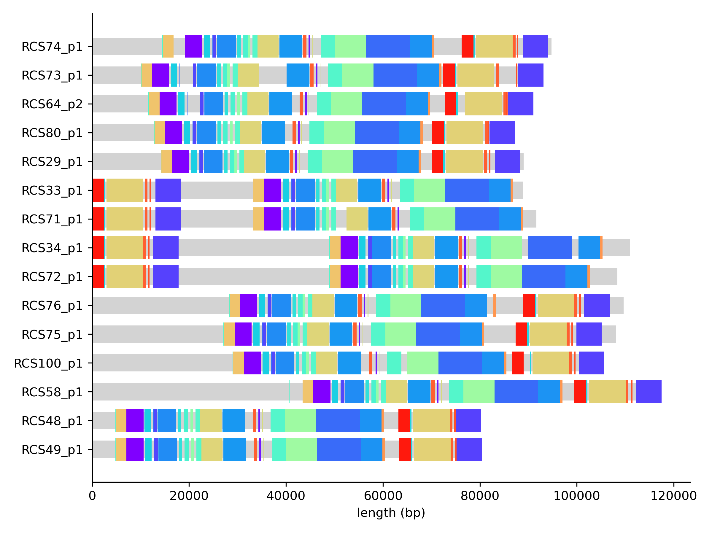
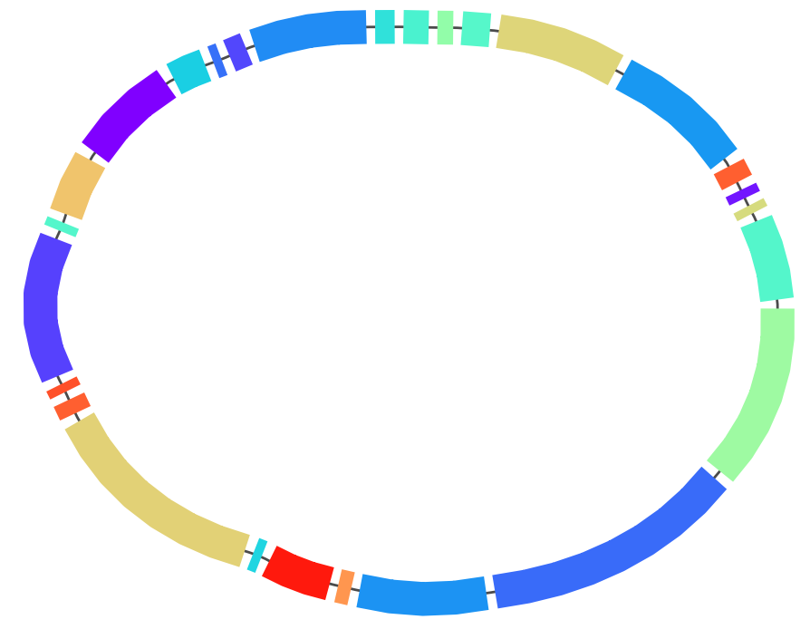
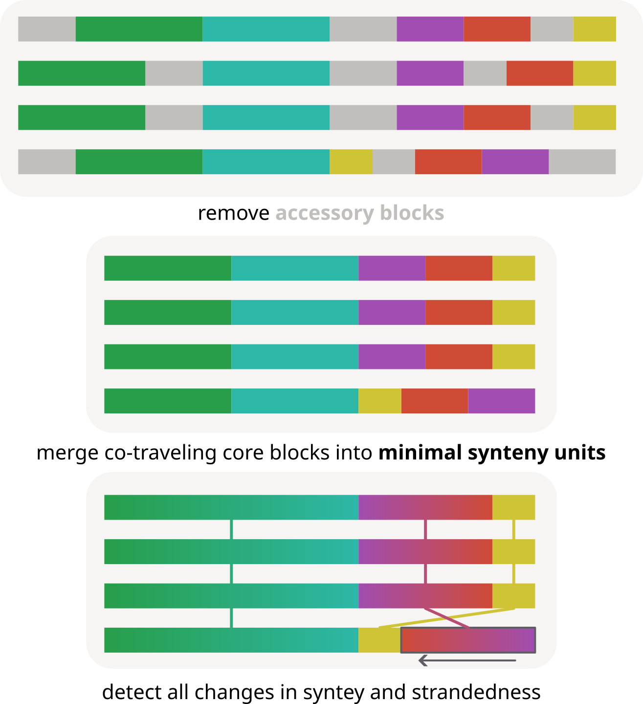
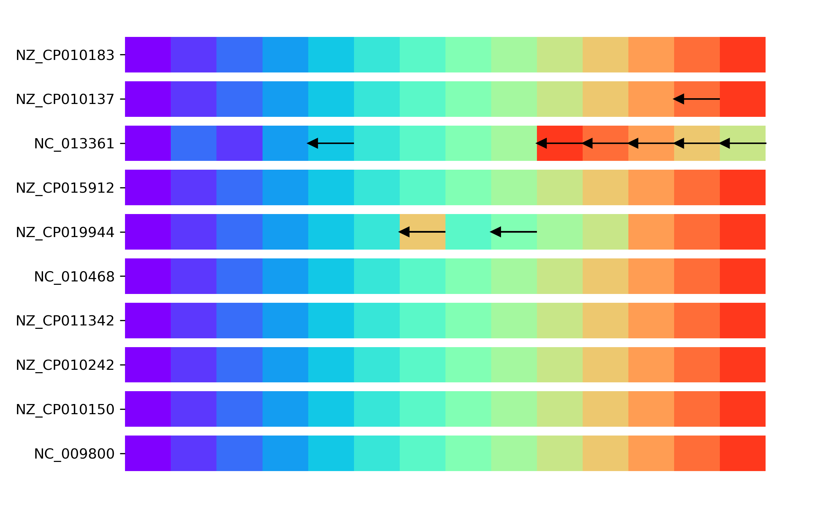
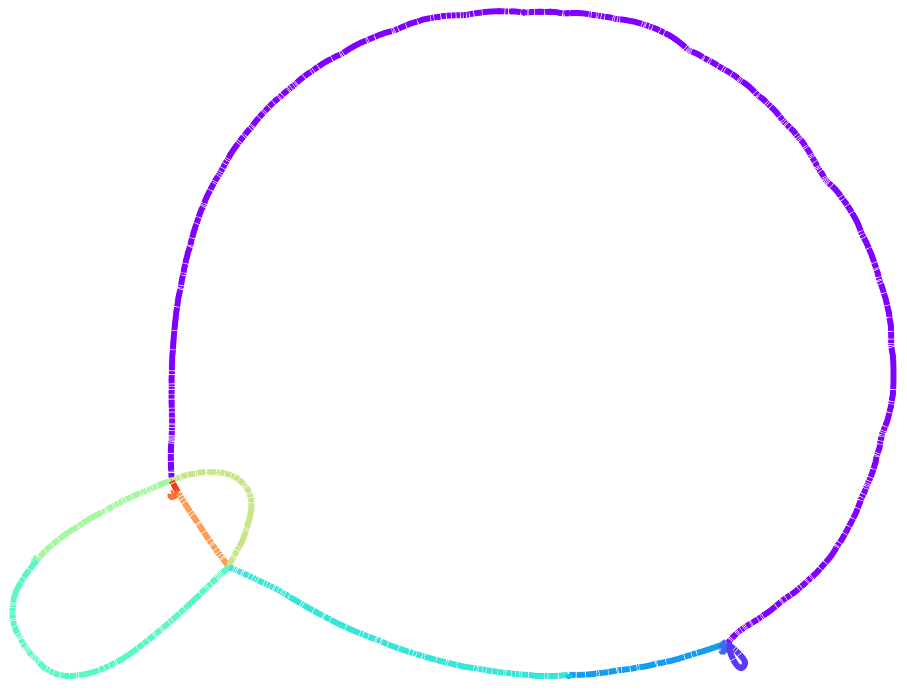

# Paths and core genome synteny

In this tutorial we will learn how to visualize paths in a pangraph and to survey changes in core-genome synteny.

## visualizing paths

As discussed in the introduction, paths are representation of genomes as sequences of blocks. After loading a graph, we can export a simple representation of the graph with the `to_path_dictionary` method. This method returns a dictionary where each key is the name of a path and the value is a list of tuples. Each tuple contains the block id and the strand of the block in the path.

```python
import pypangraph as pp

graph = pp.Pangraph.from_json("plasmids.json")

path_dict = graph.to_path_dictionary()
print(path_dict)
# {
#   'RCS48_p1': [(14710008249239879492, True), (8000128254022432074, True), ... ],
#   'RCS80_p1': [(14710008249239879492, True), (8000128254022432074, True), ... ],
#   ...
# }
```

Combining this representation with information on block lengths and frequency, we can easily create simple visualizations for the paths. For example we can assign different random colors to core blocks and color all non-core blocks in gray.

```python
import matplotlib.pyplot as plt
import matplotlib as mpl
import numpy as np
from collections import defaultdict

block_stats = graph.to_blockstats_df()
# dictionary to assign a new random color to each block
block_color = defaultdict(lambda: plt.cm.rainbow(np.random.rand()))

fig, ax = plt.subplots(figsize=(8, 6))

y = 0
for path_name, path in path_dict.items():
    x = 0
    for block_id, block_strand in path:

        L = block_stats.loc[block_id, "len"] # block consensus length
        is_core = block_stats.loc[block_id, "core"]
        
        # block color
        color = block_color[block_id] if is_core else "lightgray"
        block_color[block_id] = mpl.colors.to_hex(color)

        height = 0.8 if is_core else 0.6 # block thickness
        
        ax.barh(y, L, left=x, height=height, color=color)
        
        x += L
    y += 1

ax.set_yticks(range(len(path_dict)))
ax.set_yticklabels(path_dict.keys())
ax.set_xlabel("length (bp)")
plt.show()
```



From this plot we observe a strong conservation in the order of core blocks. This is even more explicit if we look at the graph in [Bandage](https://rrwick.github.io/Bandage/). We can use the export function of pangraph to export the graph in GFA format. By adding the `--no-duplicated` flag and the `--minimum-depth 15` option we can make sure that only core blocks are exported.

```bash
pangraph export gfa --no-duplicated --minimum-depth 15 plasmids.json > plasmids_core.gfa
```

Moreover we can save the block colors that we used in the previous plot in a csv file, that can be loaded by Bandage to color the blocks.

```python
pd.Series(block_color, name="Colour").to_csv("block_colors.csv")
```

After loading the graph and coloring it we obtain the following picture:




This shows immediately that the order of core blocks is perfectly conserved in our dataset.

## core genome synteny

Plasmids are a relatively simple case to visualize and study, since they are small and have a low number of blocks. For full chromosomal genomes, visualizations can be too complex to be informative.

For these cases, pypangraph provides a method to quickly survey all changes in core-genome synteny. This method relies on defining _minimal synteny units_ (MSUs), which are sets of core-blocks that always follow one another in the same order and orientation in all genomes, and if the accessory genome was to be removed they could all be merged together in a single block.



For this part of the tutorial we will analyze the `graph.json` file created [in the first tutorial](../tutorial/t01-building-pangraph.md#building-the-pangraph), containing 10 _E. coli_ chromosomes. The minimal sinteny units for this graph can be extracted with the function:

```python
graph = pp.Pangraph.from_json("graph.json")

# find MSUs
threshold_len = 100  # minimal length of core blocks to consider
MSU_mergers, MSU_paths, MSU_len = pp.minimal_synteny_units(graph, threshold_len)
```

This returns three objects:

- `MSU_mergers`: a dictionary where keys are core block ids and the values are the ids of the MSU they belong to.
- `MSU_paths`: a dictionary where keys are path ids and values are paths composed of MSUs instead of blocks.
- `MSU_len`: a list of the lengths of the MSUs in basepairs, i.e. the sum of consensus length of the core blocks that compose them.

We can draw a linear representation for paths in terms of the MSUs with the following code, in which each MSU is represented as a colored block of unit size. Arrows indicate inversions.

```python
import matplotlib.pyplot as plt
import matplotlib as mpl
from collections import defaultdict

# dictionary to assign colors to MSUs
cmap = mpl.colormaps["rainbow"]
color_generator = (cmap(i / len(MSU_len)) for i in range(len(MSU_len)))
colors = defaultdict(lambda: next(color_generator))

fig, ax = plt.subplots(figsize=(8, 5))

for i, (iso, path) in enumerate(MSU_paths.items()):
    for j, node in enumerate(path.nodes):
        ax.barh(i, 1, left=j, color=colors[node.id])
        if not node.strand:
            ax.arrow(j + 1, i, -0.8, 0, head_width=0.2, head_length=0.2)
ax.set_yticks(range(len(MSU_paths)))
ax.set_yticklabels(list(MSU_paths.keys()))
plt.show()
```



We observe that, while most genomes have a conserved order of MSUs, three genomes present variations. These consist of inversions or transloacations of a set of core blocks.

Similarly to what done for plasmids, we can visualize these units on Bandage. We can export the graph in GFA format, only keeping core blocks, with:

```bash
pangraph export gfa \
    --no-duplicated \
    --minimum-depth 10 \
    graph.json > ecoli.gfa
```

And then we can export the dictionary of core-block colors with:

```python
block_colors = {}
for block_id in graph.blocks.keys():
    if block_id in MSU_mergers:
        block_colors[block_id] = mpl.colors.to_hex(colors[MSU_mergers[block_id]])
    else:
        block_colors[block_id] = mpl.colors.to_hex("lightgray")
pd.Series(block_colors, name="Colour").to_csv("block_colors.csv")
```

After loading the graph in Bandage and coloring the blocks we obtain the following picture:

