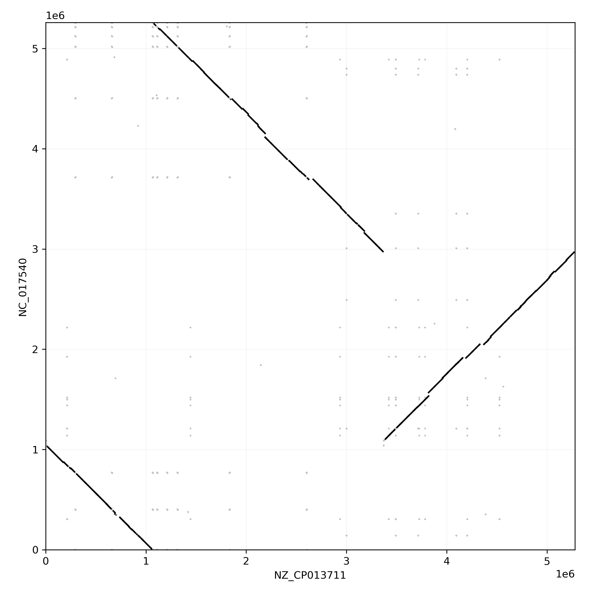
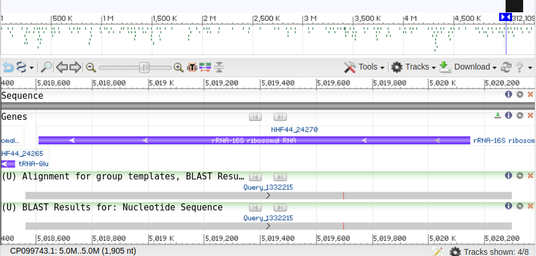

# Comparing two genomes in a dotplot

Decomposing genomes in separate blocks provides a very good starting point for pairwise comparison between genomes. The pangenome graph can easily be used to draw a dotplot between two different paths, in which lines represent shared blocks.

In this example we consider the `klebs_pangraph.json` graph generated from 9 complete chromosomes of _Klebsiella Pneumoniae_ in [a previous tutorial](../tutorial/t04-graph-projection.md).

PyPangraph provides a convenient `dotplot` function to generate such a dotplot:

```python
import pypangraph as pp
import matplotlib.pyplot as plt

# load pangraph
pan = pp.Pangraph.from_json("klebs_pangraph.json")

# paths to be compared
str_i, str_j = ["NZ_CP013711", "NC_017540"]

fig, ax = plt.subplots(figsize=(8, 8))
pp.dotplot(ax, str_i, str_j, pan, duplicated_color="silver", min_length=150)
plt.show()
```


<details>
<summary>Click here to see the full code, in case you want to customize it</summary>

```python
import pypangraph as pp
import matplotlib.pyplot as plt
from collections import defaultdict
from itertools import product
from dataclasses import dataclass

@dataclass
class Segment:
    """
    Representation for a node of a path as a segment,
    with a start and end coordinate and a strandedness.
    """

    start: int
    end: int
    strand: bool

    def flip(self):
        """
        Flip the segment orientation.
        Exchange start and end coordinates and flip the strandedness.
        """
        return Segment(self.end, self.start, not self.strand)

    def length(self, L):
        """
        Calculate the length of the segment.
        If total path length L is provided, calculate the length modulo L.
        """
        if L is None:
            return self.end - self.start
        else:
            return (self.end - self.start) % L

    def crosses_origin(self):
        """
        Check if the segment crosses the origin, i.e. start > end
        """
        return self.start > self.end

    def split_across_origin(self, L):
        """
        Split the segment into two segments if it crosses the origin.
        """
        assert self.crosses_origin()
        s1 = Segment(self.start, L, self.strand)
        s2 = Segment(0, self.end, self.strand)
        f = s1.length(L) / self.length(L)
        return s1, s2, f

    def split_fraction(self, f, flip, L):
        """
        Split the segment into two segments based on a fraction of the segment length
        """
        assert 0 <= f <= 1
        l = self.length(L)
        l1, l2 = f * l, (1 - f) * l
        if flip:
            l1, l2 = l2, l1
        s1 = Segment(self.start, (self.start + l1) % L, self.strand)
        s2 = Segment((self.end - l2) % L, self.end, self.strand)
        return s1, s2


def block_segment_dictionary(graph, path_name):
    """
    Create a dictionary of block -> segments for a given path in the graph.
    """
    path_id = graph.paths[path_name].id
    block_sgm = defaultdict(list)
    for bid, block in graph.blocks.items():
        for nid in block.alignment.node_ids():
            node = graph.nodes[nid]
            if node.path_id == path_id:
                sgm = Segment(node.start, node.end, node.strand)
                block_sgm[bid].append(sgm)
    return dict(block_sgm)


def linear_plot(ax, sgm_i, sgm_j, **kwargs):
    """
    Dotplot for two segments
    """
    if sgm_i.strand != sgm_j.strand:
        linear_plot(ax, sgm_i, sgm_j.flip(), **kwargs)
    else:
        ax.plot([sgm_i.start, sgm_i.end], [sgm_j.start, sgm_j.end], **kwargs)


def circular_plot(ax, sgm_i, sgm_j, Li, Lj, **kwargs):
    """
    Dotplot for two segments, considering circular genomes.
    """
    if sgm_i.crosses_origin():
        si1, si2, f = sgm_i.split_across_origin(Li)
        flip = sgm_i.strand != sgm_j.strand
        sj1, sj2 = sgm_j.split_fraction(f, flip, Lj)
        circular_plot(ax, si1, sj1, Li, Lj, **kwargs)
        circular_plot(ax, si2, sj2, Li, Lj, **kwargs)
    elif sgm_j.crosses_origin():
        sj1, sj2, f = sgm_j.split_across_origin(Lj)
        flip = sgm_i.strand != sgm_j.strand
        si1, si2 = sgm_i.split_fraction(f, flip, Li)
        circular_plot(ax, si1, sj1, Li, Lj, **kwargs)
        circular_plot(ax, si2, sj2, Li, Lj, **kwargs)
    else:
        linear_plot(ax, sgm_i, sgm_j, **kwargs)


def dotplot(
    ax,
    strain_i,
    strain_j,
    graph,
    block_color="black",
    no_duplicates=False,
    duplicated_color="silver",
    min_length=None,
    circular=True,
):
    """
    Creates a dotplot comparing two paths.

    Parameters:
    ax (matplotlib.axes.Axes): The matplotlib axes object where the plot will be drawn.
    strain_i (str): The identifier for the first path.
    strain_j (str): The identifier for the second path.
    graph (Graph): pangenome graph object.
    block_color (str, optional): The color used for non-duplicated blocks. Defaults to "black".
    no_duplicates (bool, optional): If True, duplicated blocks will not be plotted. Defaults to False.
    duplicated_color (str, optional): The color used for duplicated blocks. Defaults to "silver".
    min_length (int, optional): Minimum length of blocks to be plotted. Defaults to None.
    circular (bool, optional): If True, plots the segments in a circular layout. If False, uses a linear layout. Defaults to True.
    """
    # Create block segment dictionaries for the paths
    bs_i = block_segment_dictionary(graph, strain_i)
    bs_j = block_segment_dictionary(graph, strain_j)

    # Get the nucleotide lengths of the paths
    Li = graph.paths[strain_i].nuc_len
    Lj = graph.paths[strain_j].nuc_len

    # Plot the segments
    for bid, seg_i in bs_i.items():
        if bid not in bs_j:
            continue
        color = block_color
        seg_j = bs_j[bid]

        if min_length is not None:
            # optionally skip short blocks
            block_len = len(graph.blocks[bid].consensus())
            if block_len < min_length:
                continue

        if (len(seg_i) > 1) or (len(seg_j) > 1):
            if no_duplicates:
                continue
            # color duplicated blocks in gray
            color = duplicated_color

        for si, sj in product(seg_i, seg_j):
            if circular:
                circular_plot(ax, si, sj, Li, Lj, color=color)
            else:
                linear_plot(ax, si, sj, color=color)

# Load the Pangraph from a JSON file
pan = pp.Pangraph.from_json("klebs_pangraph.json")

# paths to be compared
str_i, str_j = ["NZ_CP013711", "NC_017540"]

fig, ax = plt.subplots(figsize=(8, 8))
dotplot(ax, str_i, str_j, pan)
plt.tight_layout()
plt.show()
```

</details>



Block that are not duplicated between the two paths are displayed in black. We observe that the chromosomes differ in a large inversion.

Duplicated blocks are depicted in gray. These form a checkerboard pattern, typical of blocks that are repeated multiple times on the genome. We can get the list of most duplicated blocks using the `to_blockstats_df` method:

```python

df = pan.to_blockstats_df()
df[df["duplicated"]].sort_values("count", ascending=False).head(3)

# block_id              count  n_strains  duplicated   core   len
# 3121046370622183165     101          9        True  False   236
# 17902739066067298048     72          9        True  False  1733
# 9722346788777533867      72          9        True  False  3062
```

It is also easy to retrieve the consensus sequence of one of these blocks with:

```python
b = pan.blocks[17902739066067298048]
print(b.consensus())
# TTCATCAGACAATCTGTGTGAGCACTACAAAGGCAGGTTCTTTAAGGTAAGGA...
```

[Nucleotide blast](https://blast.ncbi.nlm.nih.gov/Blast.cgi) of this sequence reveals a match with the 16S ribosomal RNA gene.

