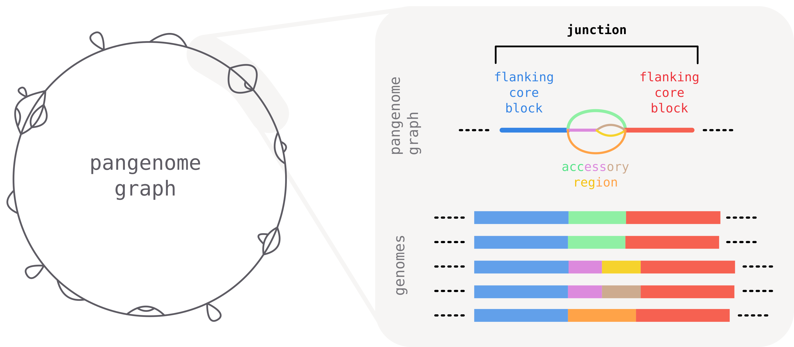
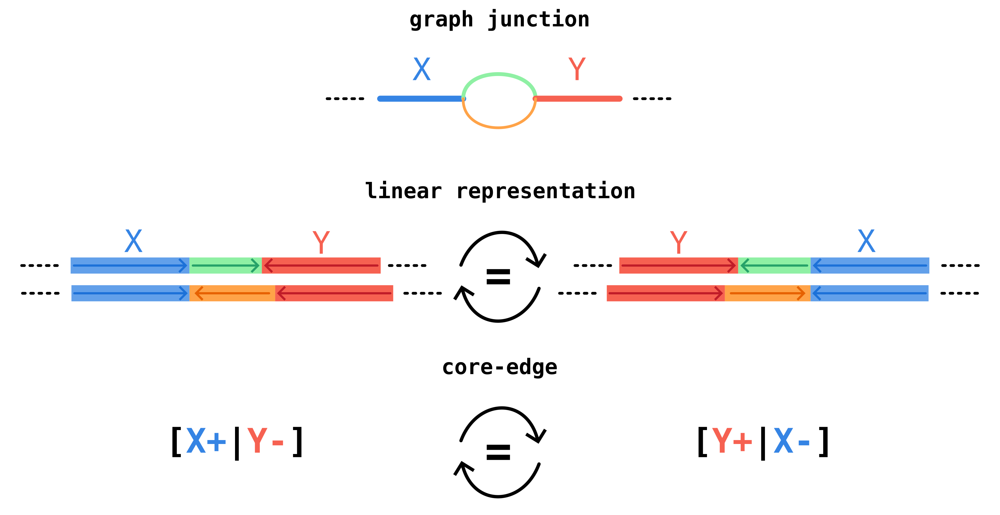

# Junctions: comparing local accessory variation

When comparing closely related bacterial genomes, the core genome is often largely **syntenic** — long stretches of conserved blocks appear in the same order across isolates. Between these conserved blocks, segments of **accessory** DNA (insertions, deletions, mobile elements) vary from one genome to another.

The largely conserved order of core segments provide a natural **frame of reference** to meaningfully break down and compare local accessory variation across isolates. To this end we introduce the concept of a **junction**: a region of the graph encompassing two adjacent core blocks.

## What is a junction?

A **junction** is defined as the part of the graph spanning two consecutive core-blocks. It starts and ends with the **two flanking core blocks** that serve as anchor points, and can contain various degrees of accessory diversity in-between.



### Unique identifiers for junctions: core edges

A graph can contain a large amount of junctions. How to uniquely identify them?

The defining feature of a junction are the two flanking core blocks. Their identity and _orientation_ determines the identity of the junction.

We call a **core edge** the oriented adjacency relation of two core blocks, neglecting accessory blocks in-between. In the example below, core blocks `X` and `Y` form a core edge with orientation `[X+|Y-]`.

This notation indicates that in genomes we observe first a sequence homologous to the consensus sequence of block `X` (denoted as `X+`) and then (potentially after an accessory region) a sequence homologous to the _reverse complement_ of the consensus sequence of block `Y` (denoted as `Y-`).

The same junction region can occur with different strandedness on different genomes, but it should still be identified as the same junction.
For this reason we define core-edges to be **invariant under reverse-complementation**, so `[X+|Y-]` and its reverse complement `[Y+|X-]` correspond to the same core edge.



In pypangraph core edges are identified by a string of the form `X_a__Y_b`, where `X` and `Y` are large integers corresponding to the `block_id` of the two blocks, and `a` and `b` are either `f` or `r`, indicating respectively forward (`+`) or reverse (`-`) orientation.

Since edges are equivalent under reverse-complementation, there are actually two possible strings that can identify an edge. To break the tie we take the lexicographically smaller. This order defines the **canonical orientation** of the junction.

## The `junctions` module in pypangraph

Pypangraph has a `junction` module to facilitate junction analyses.

In this part of the tutorial we will load and explore the `staph.json.gz` file, which contains a pangraph of 15 _Staphylococcus aureus_ chromosomes. You can download it from the pypangraph repository at [`packages/pypangraph/tests/data/staph.json.gz`](https://raw.githubusercontent.com/neherlab/pangraph/master/packages/pypangraph/tests/data/staph.json.gz).

<details>
    <summary>how was `staph.json.gz` built?</summary>

    The graph was built from 15 complete _S. aureus_ chromosomes downloaded from NCBI. To reproduce it, fetch the sequences and run `pangraph build`:

    ```bash
    ACCESSIONS="NZ_CP132362.1,NZ_LR822061.1,NZ_CP077852.1,NZ_CP162433.1,NZ_CP034011.1,NZ_CP092558.1,NZ_CP062358.1,NZ_CP132372.1,NZ_AP024511.1,NZ_CP181145.1,NZ_CP157420.1,NZ_CP080550.1,NZ_CP169947.1,NZ_CP022905.1,NZ_CP035791.1"

    # download the sequences in FASTA format
    curl -L "https://eutils.ncbi.nlm.nih.gov/entrez/eutils/efetch.fcgi?db=nuccore&id=${ACCESSIONS}&rettype=fasta&retmode=text" > staph.fa

    # build the pangraph
    pangraph build --circular -l 100 -s 20 -b 5 staph.fa -o staph.json.gz
    ```
</details>

We start by loading the graph and creating a `BackboneJunctions` object. This class identifies junctions in the graph and provides methods to analyze them.

```python
import pypangraph as pp

graph = pp.Pangraph.from_json("staph.json.gz")
print(graph)
# pangraph object with 15 paths, 664 blocks and 6817 nodes

junctions = pp.junctions.BackboneJunctions(graph, L_thr=500)
```

The constructor takes only two arguments: the graph object and a length threshold `L_thr` (default 500 bp). Core blocks shorter than this threshold are considered as too short to be reliable anchors, and are considered equivalent to accessory blocks for the purpose of junction definition.

### A look at edges

The graph has a total of 143 valid anchor core blocks.

```python
graph.to_blockstats_df().query("len > 500")["core"].sum()
# 143 core blocks
```

We can get the list of edges with:

```python
print(junctions.edges())
# ['13733442150340492168_f__17042526223432838337_f',
#  '12427448985183016017_f__13733442150340492168_f',
#  '12427448985183016017_r__14846644350907526570_f',
#  '11809679528571820295_f__14846644350907526570_r',
#  ...
# ]
# a total of 151 edges
```

There are 151 edges, which is only slightly more than the number of valid anchor blocks. This means that, as expected, the order of core blocks is strongly conserved across genomes, and across the whole dataset we expect to observe only a handful of synteny changes.

### A single junction

To get a feel for what a junction actually looks like, let's pick one and inspect it. The `junction_for` method returns the junction observed on a given isolate for a given edge:

```python
J = junctions.junction_for(
    isolate="NZ_CP162433.1",
    edge_str="3156970751805415521_f__4335229004353524956_f",
)

print(J)
# [4335229004353524956|-|n9037...] <-- [8061...|-|n6246...]_[12150...|-|n15781...] --> [3156970751805415521|-|n4000...]
```

The `repr` summarises the three pieces of the junction — the left flanking core block, the center walk of accessory blocks, and the right flanking core block — each printed as `[block_id|strand|node_id]`.

The three pieces are accessible as attributes:

```python
print(J.left)
# [4335229004353524956|-|n9037460965821963980]
print(J.right)
# [3156970751805415521|-|n4000080501404186153]
print(J.center)
# [8061287138899943998|-|n6246290944320777144]_[12150994386844653378|-|n15781614871823306740]
print(len(J.center))
# 2
```

So on this isolate the junction sits between core blocks `4335229004353524956` (7962 bp) and `3156970751805415521` (5601 bp), with two accessory blocks of length 167 bp and 1345 bp between them.

Note that both flanking blocks appear on the reverse strand (`|-|`) and in swapped order with respect to the canonical edge ID we asked for (`3156970751805415521_f__4335229004353524956_f`). This is the reverse-complement symmetry introduced earlier: this isolate carries the junction in its reverse orientation, but the edge ID — the canonical, orientation-invariant identifier — is the same. The `Junction.is_canonical` method tells you which orientation a junction is in relative to its edge:

```python
edge = J.flanking_edge()
print(edge.to_str_id())
# 3156970751805415521_f__4335229004353524956_f
print(J.is_canonical(edge))
# False
```

## Next: from single junctions to summary statistics

Inspecting individual junctions like the one above gives a concrete sense of what a junction is, but a graph contains _hundreds of them_ — going through one at a time quickly becomes impractical. To get an overview of the structural variation landscape, and to spot the junctions worth zooming in on, we need **summary statistics** across all junctions. This will be the focus of the [next part of the tutorial](t07-junction-stats.md).