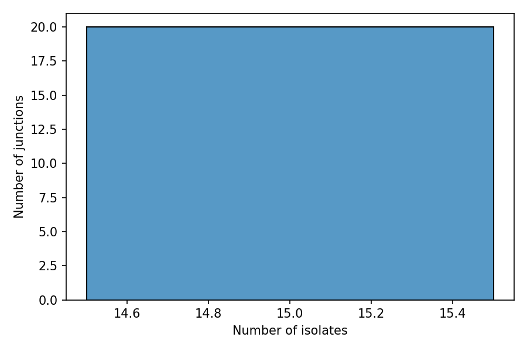
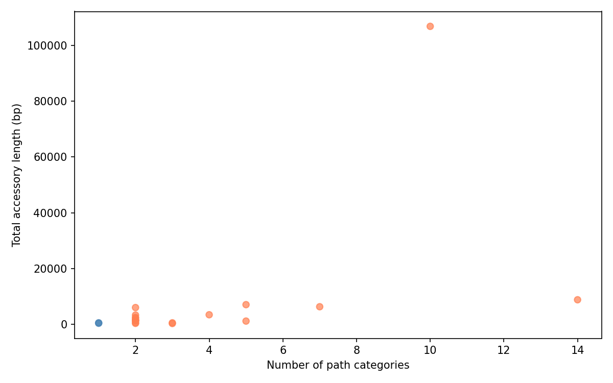
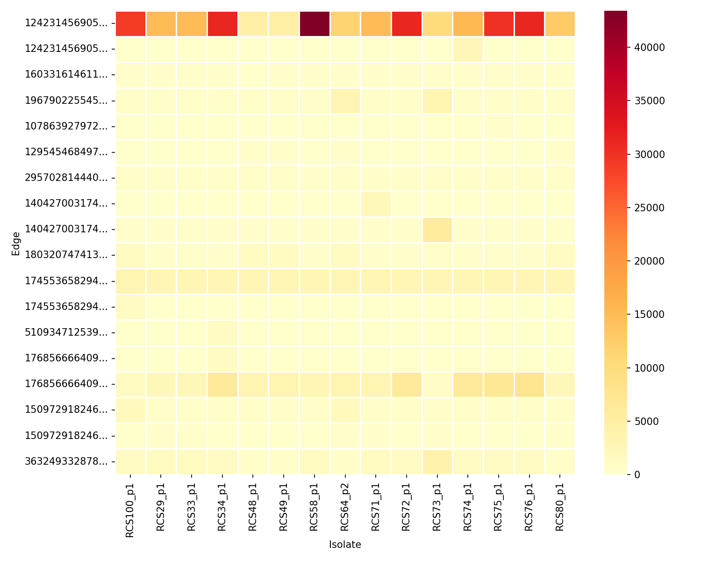

# Junction statistics

After identifying junctions (see [introduction](t06-junctions-intro.md)), we can compute per-edge statistics to characterize the landscape of structural variation. Which junctions are conserved? Which show diversity? Are there insertions unique to a single isolate?

## Computing junction statistics

```python
import pypangraph as pp

graph = pp.Pangraph.from_json("plasmids.json")
bj = pp.junctions.BackboneJunctions(graph, L_thr=500)

stats = bj.stats()
print(stats)
#                                                    frequency  n_categories  majority_category_freq  is_transitive  is_singleton  ...
# edge
# 124231456905500231_r__865151745502309237_r               15            10                       3          False         False  ...
# 124231456905500231_f__1603316146112203317_f              15             2                      14          False          True  ...
# 1603316146112203317_f__8434022508348362741_f             15             3                      12          False         False  ...
# ...
```

## Understanding the columns

The statistics dataframe has one row per edge (sorted by frequency descending) with the following columns:

- **`frequency`**: number of isolates that have this junction. When frequency equals the total number of isolates, the junction is universal — the flanking backbone blocks appear consecutively in all genomes.
- **`n_categories`**: number of distinct accessory path variants. A "category" is a unique sequence of accessory block IDs. All isolates with no accessory blocks (empty center) count as one category.
- **`majority_category_freq`**: count of the most common variant. Together with `n_categories`, this tells you how diverse the junction is.
- **`is_transitive`**: `True` if `n_categories == 1` — all isolates sharing this edge have the same accessory structure (including all-empty).
- **`is_singleton`**: `True` if exactly one isolate has a different variant from all others (`frequency > 1` and `majority_category_freq == frequency - 1`).
- **`left_core_length`** / **`right_core_length`**: consensus length (bp) of the left and right flanking backbone blocks.
- **`accessory_length`**: total unique accessory content — the sum of consensus lengths of all distinct accessory block IDs appearing in any isolate's center path for this edge. Each block is counted once even if it appears in multiple isolates.

:::info transitive vs. non-transitive junctions

A **transitive** junction has identical accessory structure across all isolates that share it. These represent conserved genomic regions — "boring" from a structural variation perspective but useful as landmarks.

**Non-transitive** junctions are where structural variation (insertions, deletions, replacements of mobile elements) occurs. These are typically the most biologically interesting targets for further investigation.

:::

## Filtering interesting junctions

To focus on junctions with complex structural variation (more than just a single isolate differing):

```python
complex_variation = stats[~stats["is_transitive"] & ~stats["is_singleton"]]
print(f"Junctions with complex variation: {len(complex_variation)}")
# Junctions with complex variation: 12
```

To select only universal junctions (present in all isolates):

```python
N = len(graph.paths)
universal = stats[stats["frequency"] == N]
print(f"Universal junctions: {len(universal)}")
# Universal junctions: 20
```

In this dataset all 20 junctions are universal (all plasmids share the same backbone structure), but only 2 are transitive:

```python
print(f"Transitive: {stats['is_transitive'].sum()}")
# Transitive: 2

print(f"Singletons: {stats['is_singleton'].sum()}")
# Singletons: 6
```

## Visualizing junction statistics

### Frequency distribution

A histogram of junction frequencies shows how many junctions are universal vs. rare:

```python
import matplotlib.pyplot as plt
import seaborn as sns

sns.histplot(stats, x="frequency", discrete=True)
plt.xlabel("Number of isolates")
plt.ylabel("Number of junctions")
```



### Accessory content vs. diversity

A scatter plot of accessory length vs. number of path categories gives an overview of junction complexity:

```python
fig, ax = plt.subplots(figsize=(8, 5))
colors = stats["is_transitive"].map({True: "steelblue", False: "coral"})
ax.scatter(stats["n_categories"], stats["accessory_length"], c=colors, alpha=0.7)
ax.set_xlabel("Number of path categories")
ax.set_ylabel("Total accessory length (bp)")
```



Non-transitive junctions (coral) span a wide range of accessory lengths, from a few hundred base pairs to over 100 kbp.

### Junction length heatmap

The junction dataframe provides a presence-absence-like view of accessory content:

```python
jdf, stats_df = bj.dataframe()

# select non-transitive junctions
variable_edges = stats_df[~stats_df["is_transitive"]].index
jdf_variable = jdf[variable_edges]

sns.heatmap(jdf_variable.T, cmap="YlOrRd", linewidths=0.5)
plt.xlabel("Isolate")
plt.ylabel("Edge")
```



This heatmap reveals which junctions carry large accessory insertions and how they vary across isolates. Rows (edges) with uniform color across columns represent junctions where all isolates carry a similar amount of accessory DNA, while rows with mixed colors indicate structural variation.
