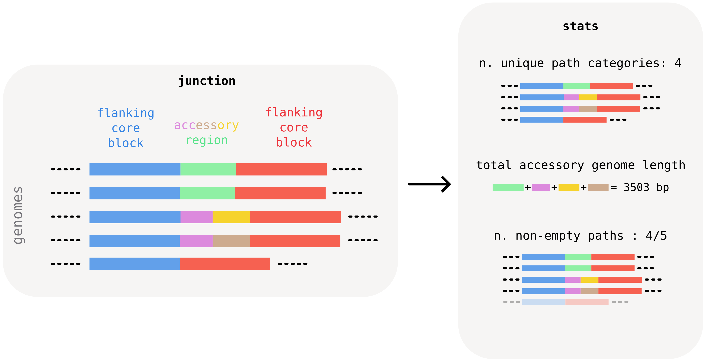
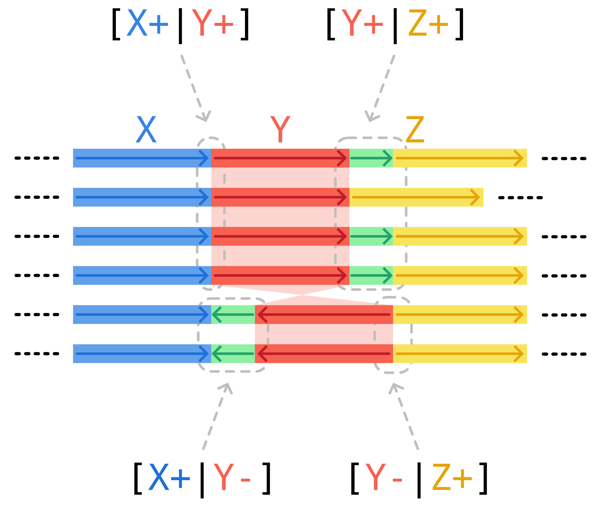
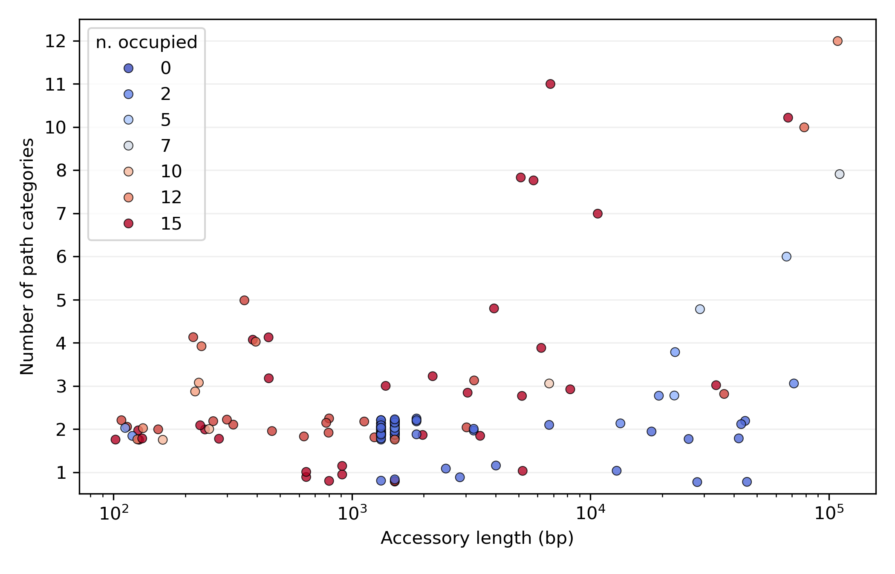

# Calculating summary junction statistics

Bacterial genomes can harbor hundreds of loci of accessory genome variability. Manual inspection of every locus is often impractical.

[In the course of our work](https://doi.org/10.1093/molbev/msae272) we found it instructive to calculate **summary statistics** for these regions, to visualize large-scale patterns in the investigated collection. Based on these statistics, one can then pick regions of interest for more detailed inspection.

Useful per-junction summaries include, for example:

- the total number of unique "accessory paths" found within the junction (including the empty one). This is an indication of the **structural diversity** of the junction. We call this the number of **path categories**. In the example below, we find 4 categories over 5 paths, since one category is repeated twice.
- the **total length of accessory genome** found in the junction. This can be calculated by summing the consensus length of all unique accessory blocks found in the junction. In the example below, the junction's total accessory length is roughly 3kb. This number gives an idea of the amount of accessory material that the junction harbors, and can help for example to distinguish recent changes associated to particular mobile genetic elements by typical size.
- the number of **non-empty paths**, i.e. paths that contain at least one accessory block. In the example below, this is every path except for the last one, which only has the flanking core block. Comparing this number to the total number of genomes gives for example an indication of whether a junction was caused by a **recent insertion**. In this case the number of non-empty (or _occupied_) paths is expected to be very small compared to the dataset size. A recent deletion would show up conversely as a junction where the number of empty paths is very small.



## Computing junction statistics with pypangraph

Pypangraph provides a convenient way to quickly calculate summary statistics for all junctions. The `BackboneJunctions.stats()` method returns a `pandas.DataFrame` with one row per core edge:

```python
import pypangraph as pp

graph = pp.Pangraph.from_json("staph.json.gz")
bj = pp.junctions.BackboneJunctions(graph, L_thr=500)

stats = bj.stats()
print(stats)
#                                                 n_isolates  n_non_empty  n_categories  accessory_length  ...
# edge
# 13733442150340492168_f__17042526223432838337_f          15           15             8              5773  ...
# 12427448985183016017_f__13733442150340492168_f          15            1             2              1512  ...
# 11809679528571820295_r__14906387308163561070_r          15           14             2              1242  ...
```

The dataframe carries nine columns (see the dropdown below for the full reference), but the three most important ones are those described above:

- **`n_categories`** — number of distinct accessory variants observed at the junction.
- **`accessory_length`** — total unique accessory content (bp) summed across all distinct accessory blocks ever seen at the junction.
- **`n_non_empty`** — out of the isolates that share the edge, how many actually carry accessory content between the two flanking core blocks (the rest have the two backbone blocks sitting directly adjacent).

In addition to this, the `n_isolates` indicates in how many isolates the junction was found. Cases where this number is smaller than the total number of paths in the graph typically indicate core-genome synteny breaks. This is discussed further in the "_transitive junctions_" dropdown below.

<details>
    <summary>**full column reference**</summary>

    - **`n_isolates`**: number of isolates that have this junction. When `n_isolates` equals the total number of isolates in the graph, the junction is universal — the flanking backbone blocks appear consecutively in all genomes. Non-universal junctions are typically a sign of synteny breaks.
    - **`n_non_empty`**: number of isolates where the junction is non-empty (carries at least one accessory block). The complement, `n_isolates - n_non_empty`, is the count of isolates where the two flanking backbone blocks sit directly adjacent with no accessory content in between.
    - **`n_categories`**: number of distinct accessory path variants. A "category" is a unique sequence of accessory block IDs. All isolates with no accessory blocks (empty center) count as one category.
    - **`n_majority_category`**: number of isolates in the most common variant. Together with `n_categories`, this tells you how diverse the junction is.
    - **`is_transitive`**: `True` if `n_categories == 1` — all isolates sharing this edge have the same accessory structure (including all-empty).
    - **`is_singleton`**: `True` if exactly one isolate has a different variant from all others (`n_isolates > 1` and `n_majority_category == n_isolates - 1`).
    - **`left_core_length`** / **`right_core_length`**: consensus length (bp) of the left and right flanking backbone blocks.
    - **`accessory_length`**: total unique accessory content — the sum of consensus lengths of all distinct accessory block IDs appearing in any isolate's center path for this edge. Each block is counted once even if it appears in multiple isolates.

</details>

<details>
    <summary>**transitive junctions**</summary>

    You might have noticed in the plot above that some junctions have `n_categories == 1`, i.e. we find only one unique accessory structure (sometimes empty) between the two flanking core blocks. We call these **transitive junctions**.

    How can a junction be transitive? This often happens in one of two ways.

    One option is the presence of fixed paralogs in the dataset. Pangraph can detect the homology of the paralogs and identify them as repeated accessory blocks. All orthologous copies of the paralog might appear in the same conserved core context, and as such in a "transitive" junction, which does not represent a locus of recent accessory variation.

    A second possibility are **synteny breaks**. Changes in the order or orientation of core blocks generate edges that are present in only a subset of isolates, even if the flanking core blocks are present in every isolate.

    In the scheme below, the inversion of core block `Y` generates two possible patterns: either genomes possess edges `[X+|Y+]` and `[Y+|Z+]`, or they have `[X+|Y-]` and `[Y-|Z+]`. All of these junctions, with the exception of `[Y+|Z+]`, are transitive. They are generated by the changes in synteny, and not by recent accessory genome variation between the flanking core blocks.

    

</details>

## Visualizing the junction landscape

A simple way to visualize the distribution of the three interesting quantities described above at a glance is a strip plot:

```python
import seaborn as sns
import matplotlib.pyplot as plt

fig, ax = plt.subplots(figsize=(7, 4.5))
sns.stripplot(
    data=stats,
    x="accessory_length",
    y="n_categories",
    orient="y",
    jitter=0.25,
    alpha=0.8,
    hue="n_non_empty",
    palette="coolwarm",
    log_scale=(True, False),
    ax=ax,
)
ax.set_xlabel("Accessory length (bp)")
ax.set_ylabel("Number of path categories")
ax.invert_yaxis()
ax.legend(title="n. non-empty", loc="upper left")
```



Reading the plot:

- most variation is in junctions with **low n. of categories** (typically around 2). These are loci of **limited structural variation**, where typically only 2 variations are found.
  - amongst these, we find bands of several junctions with characteristic lengths around 1500 and 1300 bp. These are junctions with very low n. occupied genomes (blue dots), consistent with recent and repeated activity of mobile elements such as _Insertion Sequences_.
- On the other side of the spectrum, in the top-right corner of the plot, we find **hotspots**. These are regions with high variability (almost every genome has a unique accessory pattern) and that contain a vast accessory repertoire (around 100kb of unique accessory genome across 15 isolates).

This stratification of the junction landscape lets us pick interesting candidates for closer inspection — the subject of the next tutorial section.
