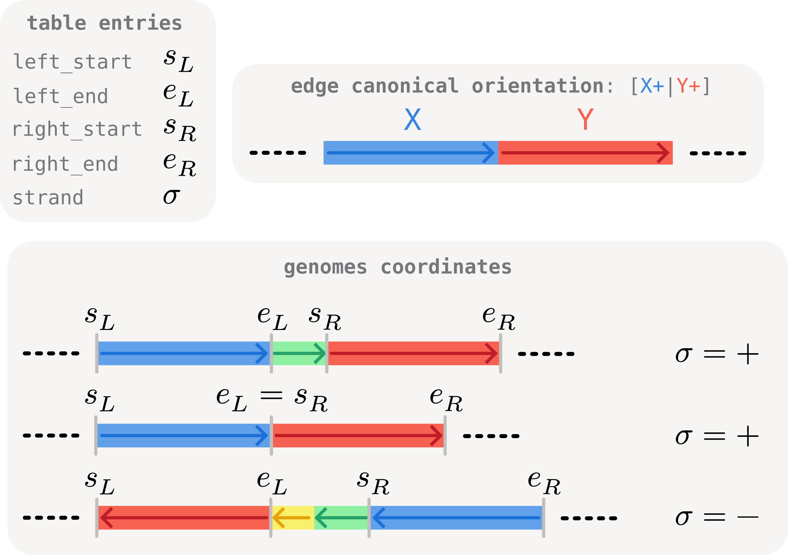
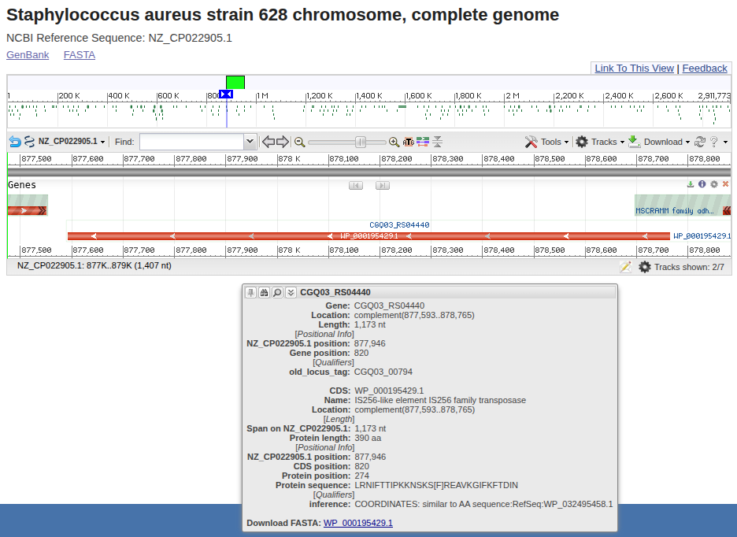
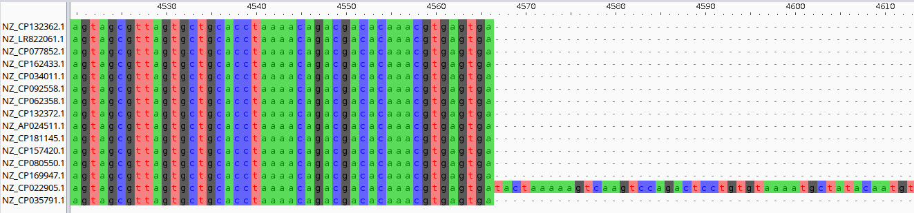
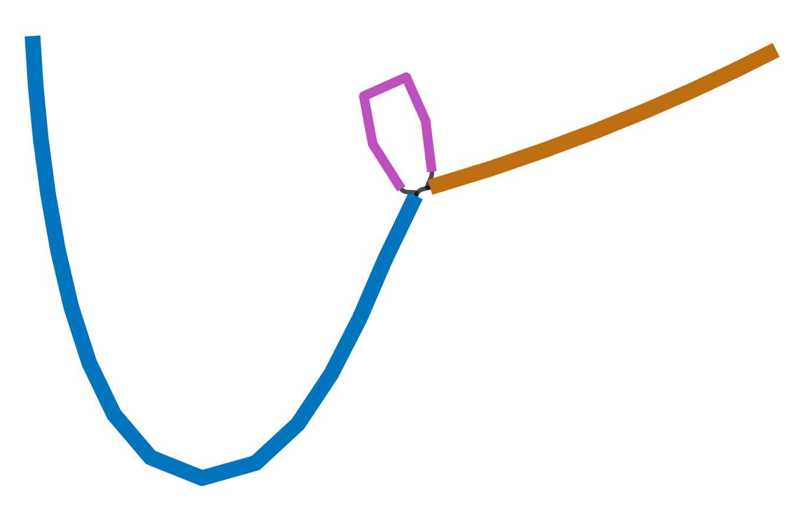

# Investigating junctions further: positions and sequences

Using summary statistics, in the [previous part](t07-junction-stats.md) of the tutorial we have singled out a junction we want to investigate further. Here we will showcase the use of two `BackboneJunctions` methods for this:

- **`positions()`** — indicates the location of each occurrence of the junction on the genomes that carry it. Useful e.g. for cross-referencing with annotation files.
- **`sequences()`** — returns the actual DNA sequence spanning the junction on every genome, as `Bio.SeqRecord` objects ready to be written to FASTA for further analysis (multiple sequence alignment, secondary pangraph construction, BLAST searches, ...).


## The example: a candidate IS insertion

As a running example we will use the same junction introduced [in the previous section](t07-junction-stats.md): the edge `10485686697184953244_r__1548999589339136461_f`. Looking up its row in the statistics dataframe:

```python
import pypangraph as pp

graph = pp.Pangraph.from_json("staph.json.gz")
junctions = pp.junctions.BackboneJunctions(graph, L_thr=500)
stats = junctions.stats()

edge = "10485686697184953244_r__1548999589339136461_f"
print(stats.loc[edge])
# n_isolates                15
# n_non_empty                1
# n_categories               2
# accessory_length        1324
# ...
```

We found multiple junctions with this specific accessory length and low number of non-empty paths, indicative of a putative recent _Insertion Sequence_ insertion.

## Coordinates of a junction on the genomes

The `positions()` method returns a `pandas.DataFrame` indexed by `(edge, isolate)`, with the genomic coordinates of the two flanking core blocks plus a strand flag. We slice on our edge of interest with `.loc`:

```python
positions = junctions.positions()
pos = positions.loc[edge]
print(pos)
#                left_start  left_end  right_start  right_end  strand
# iso                                                                
# NZ_CP132362.1     2509902   2511822      2511822    2516373   False
# NZ_LR822061.1     1288340   1290278      1290278    1294829   False
# NZ_CP077852.1     1661385   1665936      1665936    1667856    True
# ...
# NZ_CP169947.1      880245    884796       884796     886716    True
# NZ_CP022905.1      872983    877542       878866     880786    True
# NZ_CP035791.1     1215039   1216959      1216959    1221510   False
```

The columns are:

- **`left_start`**, **`left_end`** — genomic coordinates of the left flanking core block on the genome.
- **`right_start`**, **`right_end`** — genomic coordinates of the right flanking core block on the genome.
- **`strand`** — `True` if the junction appears in canonical edge orientation on this genome, `False` if reverse-complemented.

Note that - depending on the orientation of the junction on the genome - the left and right block might not always be the same. The **left block** is defined as the **first core block** of the junction to appear in the genome, as illustrated in the scheme below.

The order on the genome of these coordinates should always be `left_start` < `left_end` < `right_start` < `right_end`, irrespective of orientation. In circular genomest there can be exception to this pattern, as described below.



:::info circular genomes

In circular genomes, a junction might wrap around the genome origin. In such cases the left core block might be found around the end of the sequence, and the right core block at the beginning. As such, in these genomes the order of positions described will not be respected.

:::

The difference between the `left_end` and `right_start` coordinates gives the precise size of the accessory region. This can be empy if no accessoy blocks are present.

```python
pos.eval("right_start - left_end")
# iso
# NZ_CP132362.1       0
# NZ_LR822061.1       0
# NZ_CP077852.1       0
# ...
# NZ_CP169947.1       0
# NZ_CP022905.1    1324  <-- IS insertion
# NZ_CP035791.1       0
```

As we saw in the linear representation of the junction in the previous tutorial section, the insertion is only present in genome `NZ_CP022905.1` between coordinates:

```python
positions.loc[edge, "NZ_CP022905.1"][["left_end", "right_start"]]
# left_end       877542
# right_start    878866
```

Inspecting [this location in NCBI's GenBank viewer](https://www.ncbi.nlm.nih.gov/nuccore/1443152002?report=graph&tracks=[key:sequence_track,name:Sequence,display_name:Sequence,id:STD649220238,annots:Sequence,ShowLabel:false,ColorGaps:false,shown:true,order:1][key:gene_model_track,name:Genes,display_name:Genes,id:STD3194982005,annots:Unnamed,Options:MergeAll,CDSProductFeats:false,NtRuler:true,AaRuler:true,HighlightMode:2,ShowLabel:true,shown:true,order:5]&assm_context=GCF_003354985.1&v=877542:878866&c=00FF00&select=null&slim=0) reveals indeed the presence of an IS element, likely to have recently inserted and originated the junction.



## Extracting the junction sequences

It is often very useful for further downsream analysis, to be able to extract and further process the nucleotide sequences of a junction.

The `sequences()` method in Pypangraph has been devised for this. It returns one `Bio.SeqRecord` per isolate, spanning **left flank + accessory center + right flank**. All sequences are co-oriented to the canonical edge direction, so that no further inversion is necessary.

```python
records = junctions.sequences(edge)
for r in records:
    print(f"  {r.id}: {r.seq[:10]}...{r.seq[-10:]} | len = {len(r.seq)} bp")
# NZ_CP132362.1: ATTTGTAGCC...ACTCAGACAG | len = 6471 bp
# NZ_LR822061.1: ATTTGTAGCC...ACTCAGACAG | len = 6489 bp
# NZ_CP077852.1: ATTTGTAGCC...ACTCAGACAG | len = 6471 bp
# ...
# NZ_CP169947.1: ATTTGTAGCC...ACTCAGACAG | len = 6471 bp
# NZ_CP022905.1: ATTTGTAGCC...ACTCAGACAG | len = 7803 bp
# NZ_CP035791.1: ATTTGTAGCC...ACTCAGACAG | len = 6471 bp
```

The three IS carriers stand out as ~1.5 kb longer than the rest. Each record has:

- **`id`** — the isolate name.
- **`description`** — the canonical edge string.
- **`seq`** — the DNA from the start of the left flank to the end of the right flank.

These can be conveniently exported in a fasta file using [biopython](https://biopython.org/) for further downstream processing.

```python
from Bio import SeqIO

SeqIO.write(records, f"junction.fa", "fasta")
```

For example a multiple sequence alignment with [MAFFT](https://mafft.cbrc.jp/alignment/software/):

```bash
mafft junction.fa > junction_aligned.fa
```



Or a second, junction-specific pangraph. This usually useful in more complex junction, to refine the junction structure.

```bash
pangraph build -l 100 -s 20 junction.fa -o junction.json
pangraph export gfa junctions.json -o junctions.gfa
```



## Want to explore further?

As a further exercise you can try to explore some more interesting junctions yourself. Here are some suggestions:

- look into `13654622636097204630_f__5922465870918455593_f`.
  - Can you locate the **prophage insertion**?
  - Find its coordinates in the genome and visualize it on NCBI. Inspecting the annotations of the accessory region should confirm that it is likely a prophage integration. Where did it get integrated? _Note_: it wraps around the start of the sequence record.
  - Can you find the gene immediately upstream of the prophage insertion and the first gene of the accessory region? does this suggest a **mechanism of integration**?
- edge `10486523597117694808_f__6531151666869853507_r` is another simple example of a junction originated by an IS element insertion. When such insertions occur in the coding region of a gene, they can inactivate the gene.
  - take one of the isolates without the insertion (e.g. `NZ_CP132362.1`) and check which gene is present at the location where isolate `NZ_LR822061.1` shows an insertion. You should find that the insertion likely inactivated the [_staphylocoagulase_](https://www.uniprot.org/uniprotkb/P17855/entry), a known virulence factor.
- look into `17042526223432838337_f__8287974428665837959_r`
  - Can you spot a **duplication** in some sequences? Which genes are duplicated?
- edge `13256234721607664913_r__7427484406751306657_f` encompasses a **highly-variable region** in these genomes.
  - draw a linear representation to compare the variation across different genomes.
  - focus on one genome, e.g. `NZ_CP022905.1`, and look at the annotations. Can you find mobile genetic elements? Can you find resistance determinants?
  - the presence of _mecA_ gene and recombinases suggest that this is a [SCCmec cassette](https://en.wikipedia.org/wiki/SCCmec), a known mobile genetic element of _Staphylococcus_ bacteria that confers methicilin resistance.
