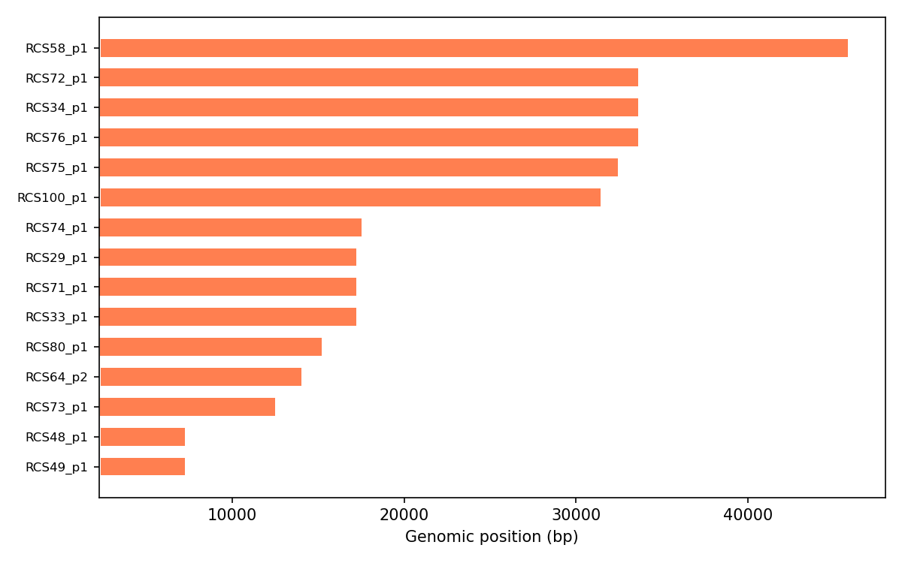

# Junction genomic positions

Once we have identified junctions of interest (see [statistics](t07-junction-stats.md)), we often need to know where they sit on each genome. The `positions()` method returns the genomic coordinates of the flanking core blocks for every junction, along with strand information.

## Computing positions

```python
import pypangraph as pp

graph = pp.Pangraph.from_json("plasmids.json")
bj = pp.junctions.BackboneJunctions(graph, L_thr=500)

pos = bj.positions()
print(pos.shape)
# (300, 5)

print(pos.head())
#                                                      left_start  left_end  right_start  right_end  strand
# iso       edge
# RCS48_p1  124231456905500231_r__865151745502309237_r       77598      2358         7261       9463   False
# RCS49_p1  124231456905500231_r__865151745502309237_r       77791      2358         7260       9461   False
# RCS64_p2  124231456905500231_r__865151745502309237_r       88401      2371        14049      16252   False
# RCS80_p1  124231456905500231_r__865151745502309237_r       84581      2331        15237      17440   False
# RCS100_p1 124231456905500231_r__865151745502309237_r      103002      2358        31434      33636   False
```

## Understanding the columns

The positions dataframe has a MultiIndex `(iso, edge)` and the following columns:

- **`left_start`**, **`left_end`**: genomic coordinates of the left flanking backbone block on this isolate.
- **`right_start`**, **`right_end`**: genomic coordinates of the right flanking backbone block.
- **`strand`**: `True` if the junction appears in the canonical edge orientation on this genome, `False` if inverted.

The accessory content of the junction sits between `left_end` and `right_start`. For circular genomes, these coordinates may wrap around the origin (i.e. `left_start > left_end`).

:::info strand interpretation

The **strand** column indicates whether the junction is traversed in the same direction as the canonical edge definition. When `strand` is `True`, the left and right flanks match the canonical edge's left and right blocks. When `strand` is `False`, the junction is traversed in the opposite direction on that genome. In both cases, `left_start/end` and `right_start/end` report the actual genomic coordinates of the flanking blocks as they appear on the genome.

:::

## Positional conservation across isolates

We can check whether a particular junction occupies the same genomic position across isolates:

```python
# pick the most frequent edge
stats = bj.stats()
edge = stats.index[0]
print(f"Edge: {edge}")
# Edge: 124231456905500231_r__865151745502309237_r

# positions for this edge across all isolates
edge_pos = pos.xs(edge, level="edge")
print(edge_pos)
#            left_start  left_end  right_start  right_end  strand
# iso
# RCS48_p1        77598      2358         7261       9463   False
# RCS49_p1        77791      2358         7260       9461   False
# ...
```

We can visualize the junction span across isolates:

```python
import matplotlib.pyplot as plt

fig, ax = plt.subplots(figsize=(8, 5))
edge_pos_sorted = edge_pos.sort_values("right_start")

for i, (iso, row) in enumerate(edge_pos_sorted.iterrows()):
    color = "steelblue" if row["strand"] else "coral"
    ax.barh(i, row["right_start"] - row["left_end"],
            left=row["left_end"], color=color, height=0.6)

ax.set_yticks(range(len(edge_pos_sorted)))
ax.set_yticklabels(edge_pos_sorted.index)
ax.set_xlabel("Genomic position (bp)")
plt.tight_layout()
```



The width of each bar represents the span of accessory content (from the end of the left flank to the start of the right flank). Differences in bar width indicate insertions or deletions at this junction across isolates.

## Connecting to genome annotations

<details>
<summary>Cross-referencing junctions with annotated features</summary>

If you have genome annotations (e.g. from a GFF file), you can cross-reference junction positions to check whether a junction overlaps with known genomic features:

```python
# Example: check if a junction overlaps with a region of interest
region_start, region_end = 10_000, 20_000
isolate = "RCS48_p1"

iso_pos = pos.loc[isolate]
overlapping = iso_pos[
    (iso_pos["left_end"] <= region_end) & (iso_pos["right_start"] >= region_start)
]
print(f"Junctions overlapping region: {len(overlapping)}")
```

This is particularly useful for identifying junctions that fall within or near known genomic islands, prophage insertion sites, or other annotated features.

</details>
