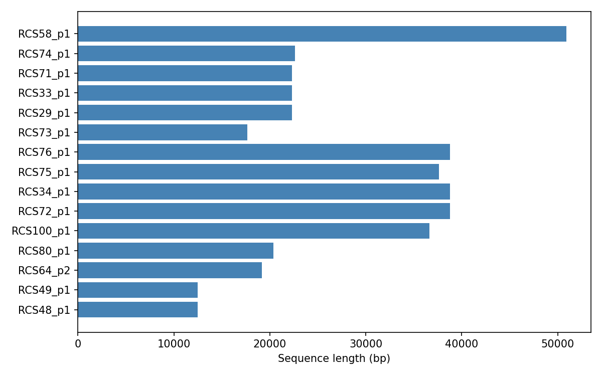

# Extracting junction sequences

After identifying interesting junctions through [statistics](t07-junction-stats.md) and [positions](t08-junction-positions.md), the natural next step is to extract the actual DNA sequences for further analysis. The `sequences()` method returns co-oriented BioPython SeqRecord objects that can be written to FASTA files, aligned, or searched against databases.

## Extracting sequences for a junction

```python
import pypangraph as pp
from Bio import SeqIO

graph = pp.Pangraph.from_json("plasmids.json")
bj = pp.junctions.BackboneJunctions(graph, L_thr=500)

# pick a non-transitive edge from the stats
stats = bj.stats()
target_edge = stats[~stats["is_transitive"]].index[0]
print(f"Edge: {target_edge}")
# Edge: 124231456905500231_r__865151745502309237_r

records = bj.sequences(target_edge)
print(f"Number of sequences: {len(records)}")
# Number of sequences: 15

for r in records[:5]:
    print(f"  {r.id}: {len(r.seq)} bp")
#   RCS48_p1: 12461 bp
#   RCS49_p1: 12460 bp
#   RCS64_p2: 19158 bp
#   RCS80_p1: 20346 bp
#   RCS100_p1: 36634 bp
```

Each returned SeqRecord contains:
- **`id`**: the isolate name
- **`description`**: the edge string ID
- **`seq`**: the full sequence spanning left flank + accessory center + right flank

All sequences are **co-oriented**: the left flanking core block always comes first, followed by the accessory center, followed by the right flanking core block. This means the core blocks are directly alignable across isolates without worrying about strand.

## Writing sequences to a FASTA file

```python
output_file = f"junction_{target_edge}.fasta"
SeqIO.write(records, output_file, "fasta")
print(f"Written {len(records)} sequences to {output_file}")
```

## Downstream analysis

### Multiple sequence alignment

The exported FASTA can be aligned with standard tools like [MAFFT](https://mafft.cbrc.jp/alignment/software/):

```bash
mafft junction_124231456905500231_r__865151745502309237_r.fasta > junction_aligned.fasta
```

### Extracting only the accessory portion

Since the sequences include the flanking core blocks, you may want to trim them to focus on the accessory content only. The flank lengths are available in the statistics:

```python
left_len = stats.loc[target_edge, "left_core_length"]
right_len = stats.loc[target_edge, "right_core_length"]
print(f"Left flank: {left_len} bp, right flank: {right_len} bp")
# Left flank: 2202 bp, right flank: 5236 bp

for r in records[:3]:
    accessory_seq = r.seq[left_len:-right_len] if right_len > 0 else r.seq[left_len:]
    print(f"  {r.id}: accessory = {len(accessory_seq)} bp")
#   RCS48_p1: accessory = 5023 bp
#   RCS49_p1: accessory = 5022 bp
#   RCS64_p2: accessory = 11720 bp
```

:::info co-orientation guarantees

All returned sequences are co-oriented: sequences from genomes where the junction appeared in the inverted orientation are automatically reverse-complemented. Individual blocks within each sequence are also reverse-complemented as needed based on their strand. This means the flanking core blocks are always in the same orientation across all isolates, making the sequences directly comparable.

:::

## Batch extraction

<details>
<summary>Exporting all non-transitive junctions to separate FASTA files</summary>

To systematically export sequences for all structurally variable junctions:

```python
import os

os.makedirs("junctions", exist_ok=True)

non_transitive = stats[~stats["is_transitive"]].index
for edge in non_transitive:
    records = bj.sequences(edge)
    if records:
        filename = f"junctions/{edge}.fasta"
        SeqIO.write(records, filename, "fasta")

print(f"Exported {len(non_transitive)} junction files")
# Exported 18 junction files
```

</details>

## Sequence length variation

Visualizing how sequence length varies across isolates for a given junction can highlight insertions and deletions:

```python
import matplotlib.pyplot as plt

lengths = {r.id: len(r.seq) for r in records}

fig, ax = plt.subplots(figsize=(8, 5))
ax.barh(list(lengths.keys()), list(lengths.values()), color="steelblue")
ax.set_xlabel("Sequence length (bp)")
plt.tight_layout()
```



Large differences in sequence length between isolates indicate insertions or deletions of mobile elements at this junction.
