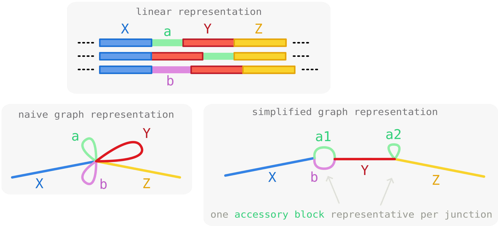
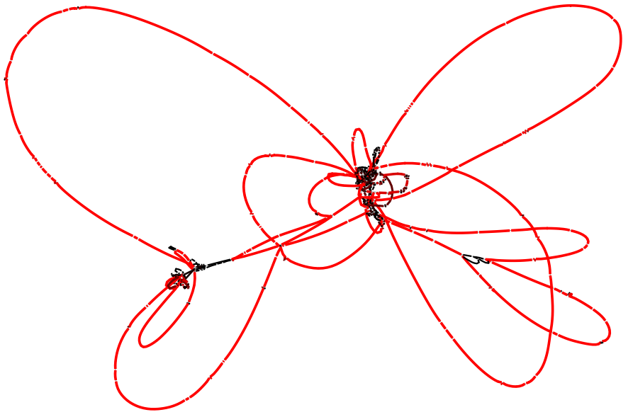
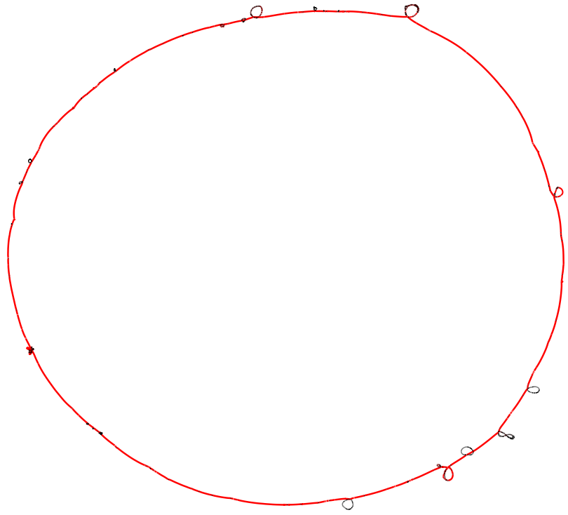
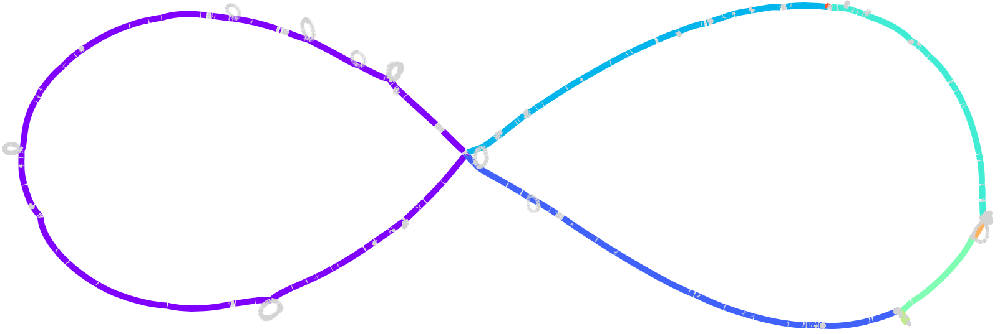
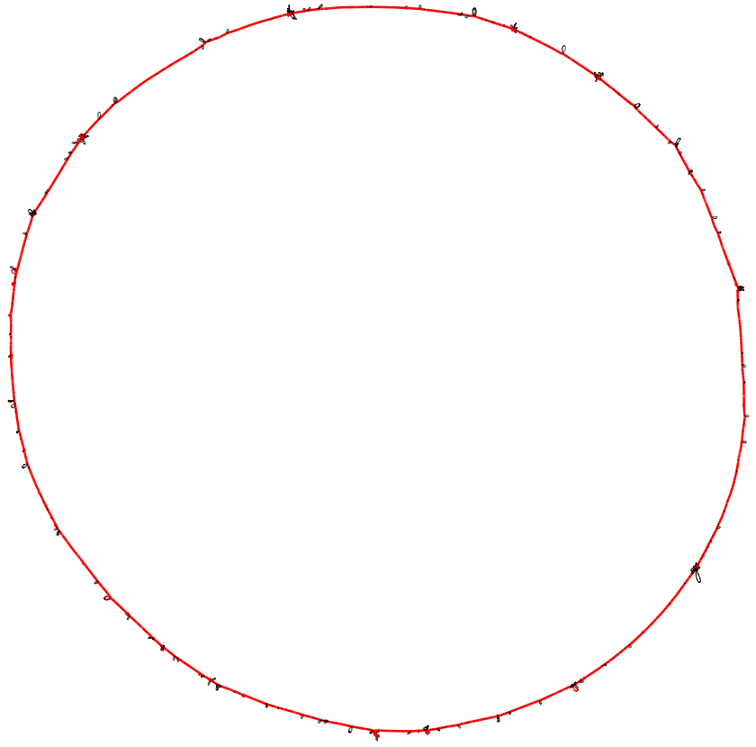

# Bonus: visually untangling graph complexity using junctions

When a whole pangenome graph is exported to GFA and opened in [Bandage](https://rrwick.github.io/Bandage/), the result is usually a **tangle**. As we saw in the [build tutorial](../tutorial/t01-building-pangraph.md), the same accessory or duplicated block can occur in many different genomic contexts, so a single segment ends up linked to many distant parts of the graph. These long-range links are what make the layout look like a hairball. This can be mitigated by filtering out duplicated blocks or even all accessory blocks, but at the cost of loosing visualization of the accessory diversity.

Junctions (introduced in [the junctions tutorial](t06-junctions-intro.md)) offer a better solution: we can keep the accessory blocks but **disentangle them by context**. The idea is to *paralog-split* each block according to the junction it sits in, so a block shared across several junctions becomes one segment per junction instead of one segment wired to all of them. The core blocks stay shared and act as anchors, and the accessory diversity is laid out as clean bubbles strung along the core-synteny backbone.

This is made more concrete in the example below:



Here we consider three core blocks(`X`, `Y` and `Z`) and two accessory blocks (`a` and `b`). Block `a` is found in two junction contexts (`[X|Y]` and `[Y|Z]`). As a consequence, paths need to traverse it twice, before and after core block `Y`. This generates tangles in the representation.

To circumvent this, we can **make use of the junction information** to de-duplicate block `a` in two occurrences (`a1` and `a2`) that can clearly be distinguished by context. As a result of this operation, the tanlge is resolved and all core junctions are clearly separated.


## The tangled starting point

We use the same `staph.json.gz` graph as the rest of the junction tutorials (15 _Staphylococcus aureus_ chromosomes). Exporting the whole graph to GFA with the CLI gives the usual tangled representation, even if we avoid exporting duplicated blocks:

```bash
pangraph export gfa --no-duplicated staph.json.gz -o staph_full.gfa
```

Opened in Bandage, this graph (494 segments, 748 links) is hard to read: accessory blocks that recur in different contexts create crossings all over the layout.



## Untangling with junction context


`pypangraph` can instead build a **junction-context resolved GFA** directly from a `BackboneJunctions` object. We load the graph, identify the junctions, and export:

```python
import pypangraph as pp
from pypangraph.export import junction_context_gfa

graph = pp.Pangraph.from_json("staph.json.gz")
junctions = pp.junctions.BackboneJunctions(graph, L_thr=500)

# paralog-split blocks by junction context (scaffold options explained below)
gfa, prefix_map = junction_context_gfa(junctions, scaffold="consensus")
gfa.write("staph_untangled.gfa")
```

This emits each block once *per junction context*: a block that occurs in several junctions becomes several segments, each prefixed by a junction tag (`J{n}__{block_id}`), while the core blocks -- the shared anchors -- their plain id and are emitted only once. Because blocks are de-duplicated by context, the export actually has **more** segments than the whole-graph GFA (1312 segments, 1742 links here) — but each one is local to a single junction, so the long-range crossings disappear and the graph reads as a clean chain of bubbles.



The second return value, `prefix_map`, maps each junction tag `J{n}` back to the core edge it came from (e.g. for writing a companion TSV). The export also records per-segment depth as a `DP:f:` tag, so Bandage can colour segments by how many isolates traverse them. The `scaffold` argument is covered in the next section.

## A second source of tangle: synteny changes

Paralog-splitting removes the crossings caused by accessory blocks, but there is a second -- usually minor -- source of tangle: **changes in core-genome synteny**. When the order or orientation of the core blocks themselves differs between genomes, the difference shows up as a "pinching point" in the visual representation (this is illustrated in the [marginalization tutorial](../tutorial/t04-graph-projection.md#a-look-at-the-marginalized-pangraph)).

The `scaffold` argument of `junction_context_gfa` decides how this is handled, by choosing which set of core-synteny edges defines the backbone:

- `"consensus"` (the default used above) keeps, for every pair of consecutive core blocks, the orientation seen in a **strict majority** of genomes. Minority rearrangements are dropped, so the synteny pinching points are smoothed out.
- a **reference isolate name**, e.g. `scaffold="NZ_CP162433.1"`, uses that single genome's own core synteny as the backbone (useful when one assembly is your reference of record).
- `"all"` keeps **every** junction — the union of all synteny variants seen across the dataset. This reintroduces the alternative orderings that the consensus scaffold drops, so it is slightly more tangled, but loses no synteny variation.

<details>
    <summary>exporting every junction with <code>scaffold="all"</code></summary>

    ```python
    gfa_all, _ = junction_context_gfa(junctions, scaffold="all")
    gfa_all.write("staph_all.gfa")
    ```

    For this graph `"all"` keeps 151 junctions versus the 143 of the consensus scaffold — the extra ones are the minority synteny rearrangements.

    

    Here the core blocks are coloured by [minimal synteny unit](t04-core-synteny.md#core-genome-synteny): a change of colour along the backbone marks a **synteny breakpoint** — one of the rearrangements that the consensus scaffold smooths away.

</details>

## Bonus: a much larger graph

The approach scales also to **large datasets**. Below is the junction-context export (consensus scaffold) of a much larger pangraph built from **222 _E. coli_ ST131 sequences** previously analyzed in [our paper](https://doi.org/10.1093/molbev/msae272). The junction decomposition resolves the structure into an interpretable overall genomic context, whereas a standard whole-graph GFA would essentially be unreadable.


