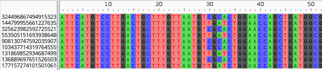
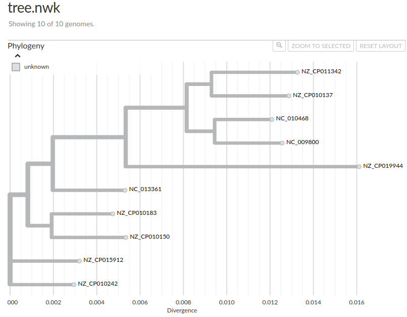

# Exporting sequences

Pangraph's [`export` command](../reference.md#pangraph-export) also allows the export of nucleotide sequences from the graph. We will cover:
- exporting the consensus sequences of all blocks
- exporting all node sequences from all blocks, aligned or not.
- exporting the core-genome alignment and building a core-genome tree.

## Exporting block consensus sequences

Block consensus sequences can be exported using the [`export block-consensus` subcommand](../reference#pangraph-export-block-consensus):

```bash
pangraph export block-consensus \
    graph.json \
    -o block_cons.fa
```

This generates the `block_cons.fa` FASTA file. This file contains one entry per block, with the block ID as the header and the consensus sequence as the sequence:

```
>9245376340613946
ATTTCCGGTGATTAAGTCTGAGGATTTT...
>12899102400345352
ATCAGACCGCTTCTGCGTTCTGATTTAA...
>19466549525654178
AAAGGTTGCTTGCCGAACGATTCGTGGT...
...
```

This file can be used for example to search for homology with a particular query sequence, e.g. a gene of interest.

## Exporting block alignments

In addition to the block consensus sequences, alignments for each block can be exported using the [`export block-sequences` subcommand](../reference#pangraph-export-block-sequences):

```bash
pangraph export block-sequences \
    graph.json \
    -o block_aln
```

This generates a `block_aln` directory containing one FASTA file per block, named `block_<block_id>.fa`. Each of these files contains the alignment for the block:

```
>324496867494915323 {"path_name":"NC_013361","block_id":158121245228334622,"start":4113083,"end":4113579,"strand":"+"}
ATTCATGTCCTTGACTGCTTTGTTAATGTCGCACTGGA...
>1447999556612276352 {"path_name":"NZ_CP011342","block_id":158121245228334622,"start":3167087,"end":3167583,"strand":"+"}
ATTCATGTCCTTGACTGCTTTGTTAATGTTGATCTGGA...
>3256239825927255217 {"path_name":"NZ_CP015912","block_id":158121245228334622,"start":2110489,"end":2110985,"strand":"+"}
ATTCATGTCCTTGACTGCTTTGTTAATGTCGCACTGGA...
...
```




The FASTA id of each entry is the node id, while the description contains a json string with additional information: the path name, block id, start and end positions of the node, and strandedness.

Note that while these alignments contain deletions, they _do not include insertions_. This is due to the fact that alignments are relative to the block consensus, against which insertions cannot be placed (see [the previous tutorial section](./tutorial_2#how-alignments-are-encoded)). However pangraph also provides the option to export complete, _but unaligned_, sequences for each block:

```bash
pangraph export block-sequences \
    graph.json \
    --unaligned \
    -o block_seqs
```

Similarly to the previous command, this generates a `block_seqs` directory containing one FASTA file per block. In this case each file contains the complete _but unalligned_ set of sequences for the block, including insertions. These can then be aligned with other tools of your choice, such as MAFFT or ClustalW.


## Exporting the core-genome alignment and building a tree

Pangraph also provides a quick command to extract the core-genome alignment of the graph: the [`export core-genome` subcommand](../reference#pangraph-export-core-genome). This is defined as the concatenated alignment of all _single-copy_ blocks that are present exactly once in all paths. The order and strandedness in which these blocks are concatenated can be specified using the `--guide-strain` option. This option takes the name of a path in the graph, and the blocks are ordered according to their order in that path.

```bash
pangraph export core-genome \
    graph.json \
    --guide-strain NC_010468 \
   -o core_genome_aln.fa
```

:::note

Also the `export core-genome` subcommand has the `--unaligned` optional flag. When activated, the complete (i.e. including insertions) but _unaligned_ core-genome sequences are exported. These can then be aligned by the user with its preferred tool.

:::

This alignment can be used for example to build a phylogenetic tree for the dataset[^1]. For example using [FastTree](http://www.microbesonline.org/fasttree/):

```bash
fasttree -nt -gtr core_genome_aln.fa > tree.nwk
```

Here is the tree, visualized with [auspice](https://auspice.us/):



[^1]: Note that this must be done with caution, as the core-genome alignment might contain recombined regions, which are not compatible with the assumptions of many phylogenetic methods. In cases when a clonal frame can still be recovered, using a recombination-aware method such as [Gubbins](https://github.com/nickjcroucher/gubbins) is recommended.
