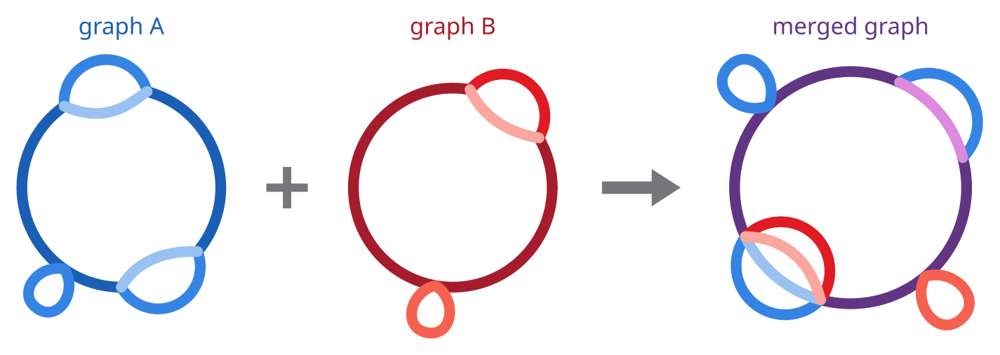

# Merging two graphs

So far we have always built a pangraph from scratch, starting from a set of sequences. The [`merge` command](../reference.md#pangraph-merge) takes a different route: it combines two graphs that already exist into a single one.



## Extending an existing graph

The typical use is **augmenting** a graph. If you have already built a graph for a collection of strains, and a new assembly becomes available, you can build a small graph for the new strain and merge it into the existing one, rather than rebuilding everything from the full set of sequences.

As an example, we extend the 10-genome _E. coli_ graph from [the first tutorial](t01-building-pangraph.md) with the reference strain K-12 MG1655. We first download its chromosome from NCBI:

```bash
curl -L "https://eutils.ncbi.nlm.nih.gov/entrez/eutils/efetch.fcgi?db=nuccore&id=NC_000913.3&rettype=fasta&retmode=text" -o NC_000913.fa
```

and turn it into a graph of its own. A graph can be built from a single sequence, in which case it simply contains one path and one block:

```bash
pangraph build --circular NC_000913.fa -o k12.json
```

The two graphs can then be merged:

```bash
pangraph merge graph.json k12.json -o graph_11.json
```

The resulting `graph_11.json` contains 11 paths: the 10 genomes of `graph.json`, in their original order, followed by K-12. Adding the eleventh chromosome created comparatively few new blocks (2896 → 2943): most of it was absorbed into blocks that already existed.

On a consumer laptop the merge takes around 20 seconds, against the roughly 3.5 minutes needed to build the 10-genome graph in the first place.

:::note merging is not bitwise equivalent to rebuilding

`merge` of the graphs built from two sets of genomes generally does not give the same exact graph as `build` on the union of those genomes: homology is discovered in a different order, so the two graphs might be partitioned into blocks slightly differently. Block counts and boundaries might differ, but overall the two graphs will be very similar.

:::
