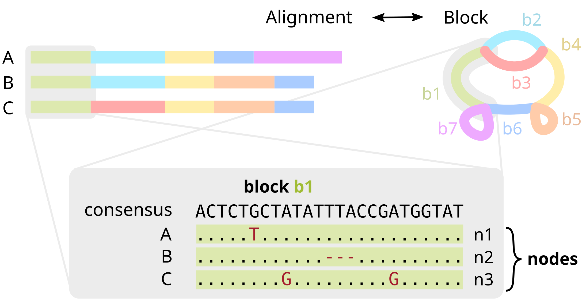
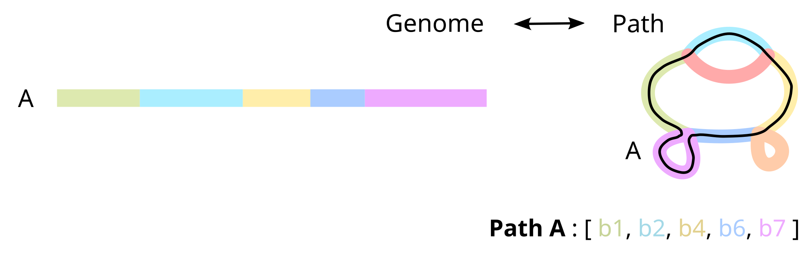
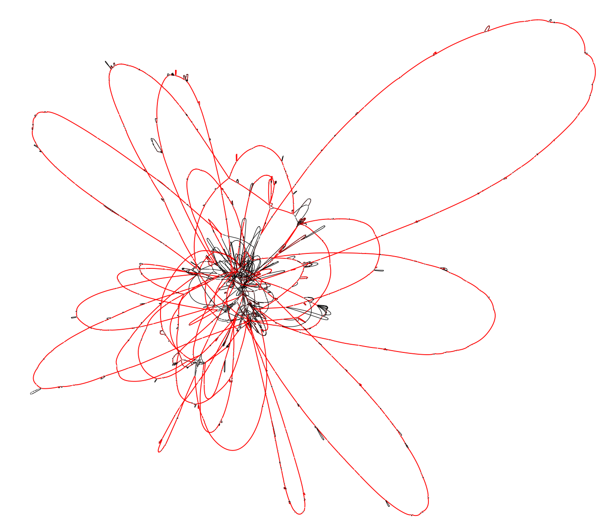
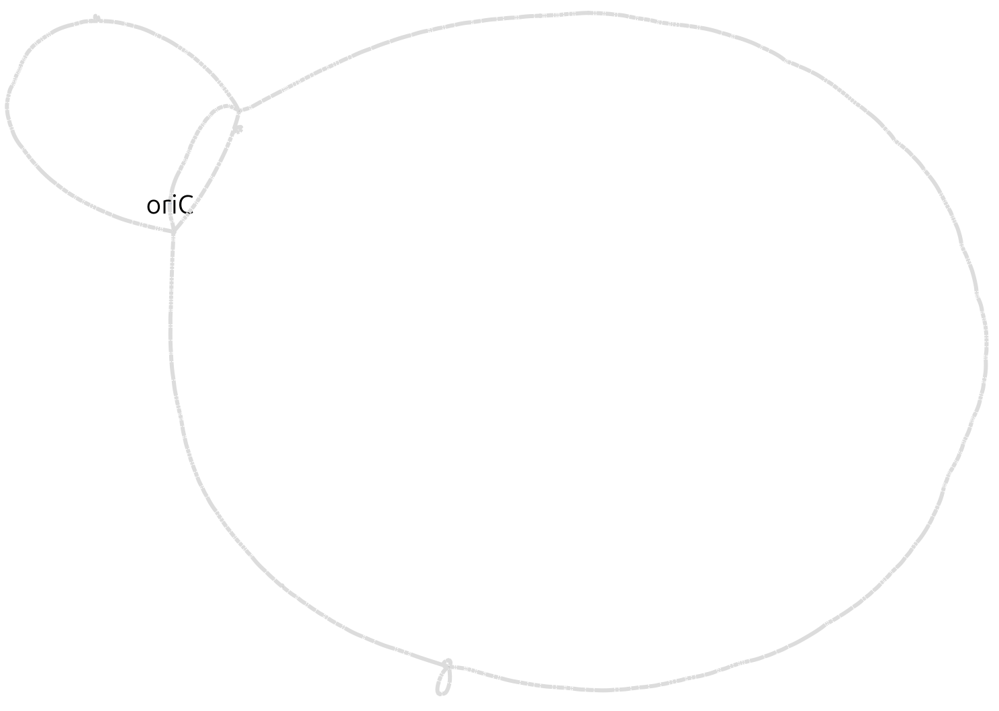

# Building a pangraph

This short tutorial will walk you through the process of generating a pangraph from a set of bacterial genomes. We will also cover how to export the generated pangraph file into other formats.

## What is a pangraph?

Simply put, a **pangenome graph** (or _pangraph_ for short) is a compressed representation of a set of genomes, in which alignable regions are saved as _blocks_ (or _pancontigs_) and genomes are represented as _paths_, i.e. list of blocks.


In more detail, **blocks** encode multiple sequence alignments of homologous parts of the sequence. Each block has a _consensus sequence_, but also stores variations (SNPs, insertions, deletions) for each particular occurrence of the block in the genome. We refer to each occurrence as a **node**.



Once genome have been partitioned into separate blocks, each genome can be represented as a walk through the blocks, named a **path**.



More specifically, a path is encoded as a list of oriented block occurrences, i.e. **nodes**. This preserves information on the strandedness of each segment, and on the mutations in each genome, and makes our representation **lossless**: we can reconstruct the original genomes exactly from the pangraph.

## Requirements

The tutorial requires you to have the `pangraph` command available in your path. Instructions on how to install pangraph can be found in [Installation](../category/installation).

For this tutorial we will use a small dataset containing full chromosomes of 10 _Escherichia Coli_ strains (source: GenBank). For convenience this dataset is available in the pangraph repository (`data/ecoli.fa.gz`), and can be downloaded with the command:

```bash
wget https://github.com/neherlab/pangraph/raw/master/data/ecoli.fa.gz
```

This is a single fasta file containing 10 fully assembled bacterial chromosomes, but no plasmids.
Note that it is not necessary for all of the data to be packed in a single fasta file. One can also pass multiple fasta files (optionally gzipped) as input to the command to build a pangraph.

## Building the pangraph

As a first step, we will build a pangraph object from the DNA of the 10 chromosomes.
This can be done using the command `build` (see [`build` command](../reference#pangraph-build)):

```bash
pangraph build -j 4 --circular ecoli.fa.gz > graph.json
```
- the option `--circular` is used when passing circular DNA sequences, like the bacterial chromosomes that we consider here.
- the option `-j 4` specifies the number of threads to use.

On a consumer laptop the command should complete in less than 5 minutes on 4 cores.

The result is a `graph.json` file that contains three main entries: `paths`, `blocks` and `nodes`:

```json
graph.json = {
    "paths": { ... },
    "blocks": { ... },
    "nodes": { ... }
}
```

As explained in the [section above](#what-is-a-pangraph), blocks contain information on the nucleotide sequence, while paths are compressed representation for genomes as lists of blocks. This files contains a compressed and lossless representation of the input genomes.

These three dictionaries contain the following information:

- The `paths` is a dictionay that connects path numbers to path objects. Each **`path`** object has two main properties: the `name`, corresponding to the sequence identifier in the input fasta file, and the `nodes` list, containing a series of node ids, each node corresponding to a particular occurrence of a block in the genome.

```json
paths = {
    "0": {
        "name": "NC_009800",
        "nodes": [7866732351691760875, 11281215587641304345, ...],
        ...
    },
    "1": {
        "name": "NZ_CP010150",
        "nodes": [10429785587629589393, 10765941013351965021, ...],
    },
    ...
}
```

- Each entry in the **`blocks`** dictionary corresponds to a different block, indexed by its own random numerical `id`. Each block element corresponds to an alignment, and its main property is the alignment `consensus` sequence.

```json
blocks = {
    "9245376340613946": {
        "consensus": "ATTTCCGGTGATTAAGTC...",
        ...
        }
    "11281215587641304345": {
        "consensus": "CTTCTAGGCTAGCTAGT...",
        ...
    },
    ...
}
```

- Finally, the **`nodes`** dictionary provides a connection between nodes and path. Each node is identified by its `id`, used as key in the dictionary, and is associated to its `block_id` and `path_id`.

```json
nodes = {
    "539582348881474": {
      "block_id": 16869306503019140931,
      "path_id": 5,
      ...
    },
    "1955246786506684": {
      "block_id": 16260464326956387790,
      "path_id": 7,
      ...
    },
    ...
}
```

More details on the structure of this `json` file will be covered in the [next tutorial section](tutorial_2.md).


### Sequence diversity and alignment sensitivity

As discussed in our [paper](https://neherlab.github.io/pangraph/#Citing-PanGraph), two variables control the maximum diversity of homologous sequences that are merged in the same block: the **sensitivity of the alignment kernel** and the **values of the pseudo-energy hyperparameters** $\alpha$ and $\beta$.

Pangraph can be run with two options for the alignment kernel:
- `-k minimap2`: uses the default minimap2 alignment kernel, with *asm10* option. This kernel find matches between sequences with up to 10% divergence. Sensitivity can be increased to 20% adding the option `-s 20`, which runs minimap with the *asm20* option. 
- `-k mmseqs`: uses [mmseqs2](https://github.com/soedinglab/MMseqs2) as alignment kernel. This is able to find matches on sequences with up to around 30% sequence divergence, at the cost of higher computational time.

Moreover, as explained in the [paper](https://neherlab.github.io/pangraph/#Citing-PanGraph) only matches with negative pseudo-energy are performed. The value of the pseudo-energy depends on two parameters:
- Parameter $\alpha$ (command line option `-a`) controls the cost of splitting a block into smaller units. Decreasing this costs results on average in a more fragmented graph, but with "deeper" alignments that contain more sequences.
- Parameter $\beta$ (command line option `-b`) controls the diversity cost. This is the cost associated to aligning sequences that are highly diverged. In particular, matches in which the pairwise diversity $d > 1 /\beta$ are discarded. Decreasing this cost allows merging of more diverged sequences. The default value $\beta=10$ sets a default sequence diversity threshold of 10%.

Therefore, **as a rule of thumb**:
- if the average pairwise diversity of homologous sequences in your sample is below 5%, running pangraph with option `-k minimap2 -s 20 -b 5` will results in most merges performed correctly.
- above this threshold, it is advised to use mmseqs2 as an alignment kernel, and optionally decreasing further the values of the energy hyperparameters `-k mmseqs -a 0 -b 0`.

Note that, depending on the kmer size (`-K` argument in pangraph) mmseqs2 can require several Gb of available memory to run.

## Exporting the pangraph to gfa format

The pangraph object can also be exported in other more common formats using the command `export` (see [Export](@ref)).

As a first example, we consider exporting the pangraph in [Graphical Fragment Assembly](https://github.com/GFA-spec/GFA-spec) format. This can be done with the following command:

```bash
pangraph export gfa \
    --no-duplicated \
    graph.json \
    > graph.gfa
```

This will create a `graph.gfa` file, which can be visualized using [Bandage](https://rrwick.github.io/Bandage/).

The option `--no-duplications` causes the export function to avoid including duplicated blocks in the graph representation (they are instead exported as isolated blocks). In our experience this results in a less "tangled" visual representation. Below is how the Bandage visualization of this example pangraph looks like. Blocks are colored by frequency, with common blocks (appearing in many different chromosomes) in red and rare blocks (appearing in only a few chromosomes) in black.



The visual representation still appears very tangled, due to the fact that many accessory blocks appear in different locations in different genomes. To simplify the representation, we can export only the core genome. This can be done by adding the option `--minimum-depth 10`, which will include only blocks that appear in at least 10 different genomes. We can also include the consensus sequences of the blocks in the output file with the option `--include-sequences`. This allows us to run BLAST searches on the graph, for example to locate the origin of replication (_oriC_).

```bash
pangraph export gfa \
    --no-duplicated \
    --minimum-depth=10 \
    --include-sequences \
    graph.json \
    > graph_core.gfa
```

The resulting graph is much simpler. The remaining crossings are due to changes in core-genome synteny. Each change in order of core blocks results in a crossing in the graph, as will be discussed in [a later tutorial section](../pypangraph/tutorial4.md).

