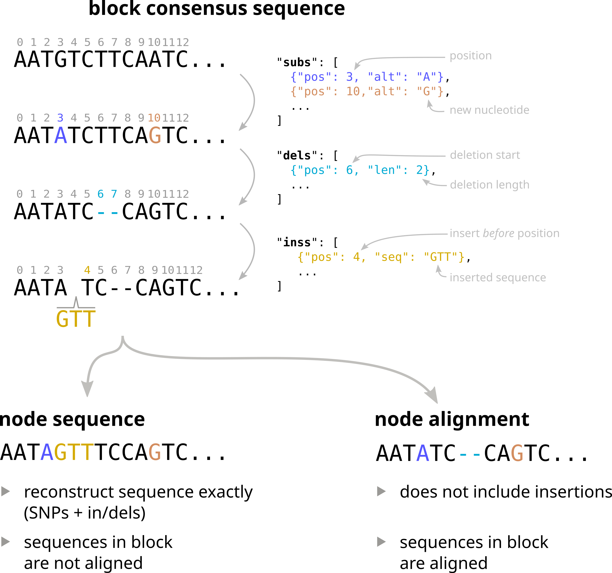

# The structure of Pangraph output file

In this second part of the tutorial we will explore in more detail the content of the `json` output file produced by the [`build` command](../reference#pangraph-build).
As an example, we will use snippets from the `graph.json` file that was produced in the previous section of the tutorial.


## The structure of `graph.json`

As discussed in the [previous tutorial section](./tutorial_1.md#what-is-a-pangraph), the three main entries of pangraph output file are `paths`, `blocks` and `nodes`.

- each entry in the `paths` list encodes one of the nucleotide sequences that were given as input to the `build` command, represented as a list of nodes (i.e. particular instances of a block)
- each entry in the `blocks` list represents an alignable set of homologous sequences. A block contains the consensus of all of these sequences, together with information to reconstruct the full alignment. Each entry in the alignment is represented by a `node`.
- the `nodes` list represents the connection between blocks and paths. Each node entry contains information on which block and path the node is assigned to.

We will explore each of these categories separately.


## Paths

A path object has the following structure:

```json
{
    "id": 1,
    "name": "NZ_CP010150",
    "nodes": [10429785587629589393, 10765941013351965021, 7771937209474314297, ...],
    "circular": true,
    "tot_len": 4827779,
    "desc": null
},
```

The two main properties of a path are `name` and `nodes`. The `name` of the path corresponds to the sequence identifier in the input fasta file.
`nodes` contains the ordered list of node ids that make up the path.

Here is a complete list containing a description of every entry in the path object:

- `id`: numerical id of the path. Each path is assigned a unique progressive id when building the graph.
- `name` : the path sequence identifier, as specified in the input fasta file.
- `nodes` : the ordered list of node ids that make up the path.
- `circular` : indicates whether the considered sequence is circular (e.g. plasmid) or not. This is controlled by the `--circular` flag of the [`build` command](../reference#pangraph-build).
- `tot_len` : the total length of the path, in nucleotides.
- `desc` : (optional) path description string, corresponding to the description field in the input fasta file. For example `>NZ_CP010150 Escherichia coli strain 1303 chromosome, complete genome` would be split in `name="NZ_CP010150"` and `desc="Escherichia coli strain 1303 chromosome, complete genome"`.


## Nodes

Nodes constitue the connection between block and paths. A node indicartes a particular occurrence of a block in a path sequence. A node object has the following structure:

```json
{
    "id": 10429785587629589393,
    "block_id": 9245376340613946,
    "path_id": 1,
    "strand": "+",
    "position": [356656, 359732]
},
```

The properties of a node are:
- `id` : a unique random numerical id assigned to the node.
- `block_id` : the id of the block that the node belongs to.
- `path_id` : the id of the path that the node is part of.
- `strand` : indicates whether on the original input sequence the consensus sequence of the block appears in the forward (`+`) or reverse (`-`) strand.
- `position` : start and end position of the node on the input sequence. Positions are always in 0-based numbering with right extreme excluded. They are also based on the forward strand (with beginning < end). The only exception is when a block wraps around the end of a circular sequence. In this case the node start position (close to the end of the genome) is higher than the node end position (close to the beginning of the genome).


## Blocks

Blocks encode alignments of homologous sequences across the input genomes.
Each block object has the following structure:

```json
{
    "id": 9783460543474296593,
    "consensus": "AACGGCAATATCTGCCACAAA...",
    "alignments": {
        "5252840658835653895": {
            "subs": [ ... ],
            "dels": [ ... ],
            "inss": [ ... ]
        },
        "7608024242617339186": {
            "subs": [ ... ],
            "dels": [ ... ],
            "inss": [ ... ]
        },
        ...
    }
}
```

Each block contains the following properties:
- `id` : a unique random numerical id assigned to the block.
- `consensus` : the consensus sequence of the block.
- `alignments` : a dictionary that contains information to reconstruct the sequence alignment. Keys are node ids, while values are a list of variations (substitutions, deletions, insertions) that need to be applied to the consensus to obtain the node sequence.


### How alignments are encoded

Each object in the alignment dictionary contains three entries: `subs`, `dels`, and `inss`, encoding respectively substitutions, deletions, and insertions. Here is an example of an entry in the `alignments` dictionary:

```json
"5252840658835653895" : {
    "subs": [
        {
            "pos": 15,
            "alt": "A"
        },
        {
            "pos": 35,
            "alt": "G"
        }
    ],
    "dels": [
        {
            "pos": 10,
            "len": 4
        }
    ],
    "inss": [
        {
            "pos": 3,
            "seq": "CTT"
        }
    ]
}
```

- `subs` contains a list of substitutions. Each substituion contains a `pos` field indicating the position of the substitution in the consensus sequence, and an `alt` field indicating the alternative nucleotide.
- `dels` contains a list of deletions. Each deletion contains a `pos` field indicating the starting position of the deletion in the consensus sequence, and a `len` field indicating the length of the deletion.
- `inss` contains a list of insertions. Each insertion contains a `pos` field, indicating the nucleotide position _before_ which the insertion should be placed, and a `seq` field, containing the sequence to be inserted.

Note that all positions are 0-based.

Below is a schematic representation of how these variations are applied to the consensus sequence of a block to obtain the sequence of a node.



As discussed in the [next section](./tutorial_3.md), using information in the `alignments` dictionary the different sequences of a block can be reconstructed in two ways:
- as **node sequences**. In this case sequences are not aligned, but each entry corresponds to the exact sequence of a node, with all variations applied.
- as a **multiple sequence alignment**. In this case sequences are aligned, but insertions are omitted.


## A look at the length and frequency of blocks

Having completed this part of the tutorial, it is now possible to access directly the rich information contained in the pangraph output format.

As a simple example, we take the `graph.json` file and extract some information for each block:
- the length of the consensus sequence
- the number of unique strains that contain the block
- the number of nodes in the block
- the number of paths the block is found in

```python
import json
import pandas as pd

with open("graph.json", "r") as f:
    graph = json.load(f)

# block, paths and nodes dictionaries
blocks = graph["blocks"]
paths = graph["paths"]
nodes = graph["nodes"]

block_info = []
for block_id, block in blocks.items():
    # check in how many different paths the block is present
    # by going through all the nodes, and checking how many
    # different paths they are found into
    isolates = set()
    for node_id, aln in block["alignments"].items():
        node = nodes[node_id]
        path_id = node["path_id"]
        isolates.add(path_id)

    block_info.append(
        {
            "block_id": block_id,
            "length": len(block["consensus"]),  # length of consensus sequence
            "count": len(block["alignments"]),  # number of nodes in the block
            "n. strains": len(isolates),  # number of unique strains the block is found in
        }
    )
block_info = pd.DataFrame(block_info).set_index("block_id")
```

This returns the following dataframe:

|             block_id | length | count | n. strains |
| -------------------: | -----: | ----: | ---------: |
| 13361252018432335832 |  59662 |    10 |         10 |
|  8589825793449583194 |  52993 |     1 |          1 |
|  7098980105995837282 |  50602 |     1 |          1 |
|                  ... |    ... |   ... |        ... |

Alternatively, the `block_info` dataframe can be obtaine more simply using the [pypangraph](https://github.com/mmolari/pypangraph) package, a python package to open and manipulate pangraph output files:

```python
import pypangraph as pp

# load the graph
graph = pp.Pangraph.load_json("graph.json")

# calculate block statistics
block_info = graph.to_blockstats_df()
```

### Pangenome size 

From this dataframe we can easily recover the size of the pangenome and of the core genome. The first is obtained by summing the lengths of all the blocks, while the second is obtained by summing the lengths of the blocks that are present in all the strains in a single copy.

```python
pangenome_size = block_info["length"].sum()
# pangenome_size = 7.8 Mbp

is_core = block_info["n. strains"] == 10
is_core &= block_info["count"] == block_info["n. strains"] # not duplicated
core_genome_size = block_info[is_core]["length"].sum()
# core_genome_size = 3.78 Mbp
```

### High copy number blocks

From this dataframe we can for example check what is the block with highest copy number:
```python
block_info.sort_values("count", ascending=False).head(1)
```
|             block_id | length | count | n. strains |
| -------------------: | -----: | ----: | ---------: |
| 16702657954516389937 |    768 |    92 |          9 |

This is a heavily-duplicated block present 92 times in 9 different strains, with a length of 768 bps.
We can recover its sequence from the blocks dictionary:

```python
block = blocks["16702657954516389937"]
seq = block["consensus"]
# seq = GGTAATGACTCCAACTTATTGATAGTGTTTTATGTTCAGATAATGCCCGATGACTTTGTCATGCAGCTCCACCGATTTTGAGAACGACAGCGACTTCCGTCCCAGCCGTGCCAGGTGCTGCCTCAGATTCAGGTTATGCCGCTCAATTCGCTGCGTATATCGCTTGCTGATTACGTGCAGCTTTCCCTTCAGGCGGGATTCATACAGCGGCCAGCCATCCGTCATCCATACCACGACCTCAAAGGCCGACAGCAGGCTCAGAAGACGCTCCAGTGTCGCCATAGTGCGTTCACCGAATACGTGCGCAACAACCGTCTTCCGGAGCCTGTCATACGCGTAAAACAGCCAGCGCTGGCGCGATTTAGCCCCGACGTAGCCCCACTGTTCGTCCATTTCCGCGCAGACGATGACGTCACTGCCCGGCTGTATGCGCGAGGTTACCGACTGCGGCCTGAGTTTTTTAAGTGACGTAAAATCGTGTTGAGGCCAACGCCCATAATGCGGGCAGTTGCCCGGCATCCAACGCCATTCATGGCCATATCAATGATTTTCTGGTGCGTACCGGGTTGAGAAGCGGTGTAAGTGAACTGCAGTTGCCATGTTTTACGGCAGTGAGAGCAGAGATAGCGCTGATGTCCGGCAGTGCTTTTGCCGTTACGCACCACCCCGTCAGTAGCTGAACAGGAGGGACAGCTGATAGAAACAGAAGCCACTGGAGCACCTCAAAAACACCATCATACACTAAATCAGTAAGTTGGCAGCATCACC
```

Running a [nucleotide BLAST](https://blast.ncbi.nlm.nih.gov/Blast.cgi) for this sequence reveals a match with a transposase gene, which is known to be highly duplicated in bacterial genomes.


### Block length and frequency distribution

Moreover we can more generally visualize ther distribution of block lengths and frequencies.
We display:
- the cumulative distribution of block lengths
- the pangenome frequency distribution, i.e. the distribution of the number of strains in which each block is found, weighted by block length. This reveals which fraction of the pangenome is shared by how many strains.

```python
import seaborn as sns
import matplotlib.pyplot as plt

fig, axes = plt.subplots(nrows=1, ncols=2, figsize=(8, 4))

# Cumulative distribution of length
ax = axes[0]
sns.histplot(
    block_info,
    x="length",
    bins=1000,
    cumulative=True,
    element="step",
    fill=False,
    log_scale=True,
    ax=ax,
)
ax.set_title("cumulative distribution of block length")
ax.set_xlabel("block length")
ax.set_ylabel("n. blocks")

# Distribution of n. strains
# weighted by block length
ax = axes[1]
sns.histplot(
    block_info,
    x="n. strains",
    weights="length",
    discrete=True,
    ax=ax,
)
ax.set_title("pangenome frequency distribution")
ax.set_xlabel("n. strains")
ax.set_ylabel("length (bp)")

plt.tight_layout()
plt.savefig("block_stats.png")
plt.show()
```


The blocks present in this pangraph have widely varying size, with some blocks being only few hundreds of nucleotides long, and others spanning tens of kbps.[^1]

[^1]: The absence of blocks shorter than 100 bps is due to the default value of the `--len` option in the `build` command, which is set to 100. See [`build` command](../reference#pangraph-build) for more information.

The block frequency distribution shows a typical bimodal pattern, with an abundance of "core" blocks (blocks that are present in all the 10 considered chromosomes, cumulative length of more than 3.5 Mbps) and rare blocks present in only one strain (cumulative length of 2.5 Mbps).


