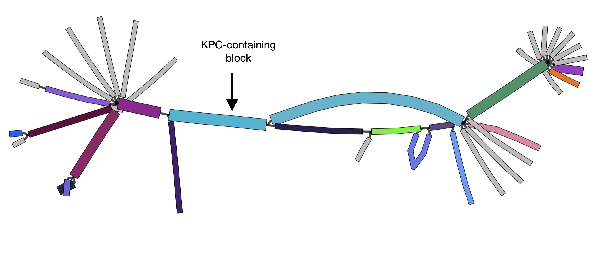
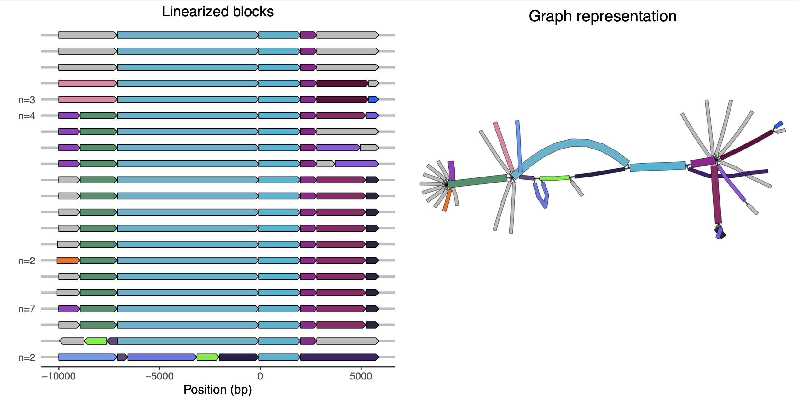

# Example application: antibiotic resistance gene neighbourhoods

Regions around antibiotic resistance genes are often structurally diverse, due to the high numbers of rearrangements e.g. those arising from repeated insertions of different insertion sequences (ISs). In this tutorial we'll use pangraph to explore a dataset of isolates which all contain a beta-lactamase gene: KPC-2 or KPC-3 (1 SNP difference). Rather than look at the whole genomes, we will explore just the immediate neighbourhood of the KPC gene.

## Dataset

We will be using a set of n=34 isolates from David et al. (2020) ([paper](https://pubmed.ncbi.nlm.nih.gov/32968015/)). This is a small part of a larger dataset of KPC-carrying _Klebsiella pneumoniae_ isolated from patients across European hospitals.

Theoretically you could run pangraph on the full genomes of the isolates. However, in this case we are only interested in the region immediately around KPC. So to prepare the data for this tutorial we have found the gene (with `blast`) and then extracted the surrounding region: 10kb upstream and 5kb downstream.[^1]

[^1]: David et al. actually long-read sequenced n=44 isolates. For simplicity, we have only kept contigs that were sufficiently long, hence 34.

You can download this dataset by running the following:

```bash
wget https://raw.githubusercontent.com/liampshaw/pangraph-tutorials/main/data/kpc/kpc-contigs-u10k-d5k.fa
```

## Running pangraph

We can now run pangraph on these extracted regions (n=34). This should take only a few seconds to run.

```bash
pangraph build kpc-contigs-u10k-d5k.fa > pangraph_kpc_u10k_d5k.json
pangraph export --edge-minimum-length 0 pangraph_kpc_u10k_d5k.json -p pangraph_kpc_u10k_d5k -o ./
```

Pangraph gives us three forms of output:

* `pangraph_kpc_u10k_d5k.json` - json file storing the whole graph
* `pangraph_kpc_u10k_d5k.gfa` - graph in [GFA](http://gfa-spec.github.io/GFA-spec/GFA1.html) format
* `pangraph_kpc_u10k_d5k.fa` - multifasta containing the consensus sequences of the pangenome blocks

We know by construction that the KPC gene should be in all the contigs, so should be in the same alignment block in all sequences. If we download the KPC gene, we can then use `blast` to find this block from the fasta file with the consensus sequences of the blocks.

```bash
wget https://raw.githubusercontent.com/liampshaw/pangraph-tutorials/main/data/kpc/kpc2.fa
makeblastdb -in pangraph_kpc_u10k_d5k.fa -dbtype 'nucl'
geneBlock=$(blastn -query kpc2.fa -db pangraph_kpc_u10k_d5k.fa -outfmt 6 | cut -f 2)
echo $geneBlock
```

The gene will be on a block with an ID that is a random string (this string will be different if you rerun pangraph; the actual block will be the same).

Similar to the previous tutorial, we then convert the gfa into a csv that stores each contig as a linear path of blocks with their start and end positions.[^2]

[^2]: We are using the consensus lengths of the block for this example. It would be better to use the actual lengths of the block in each contig.

```bash
# Download custom script
wget https://raw.githubusercontent.com/liampshaw/pangraph-tutorials/main/scripts/prepare-pangraph-gfa.py
python prepare-pangraph-gfa.py pangraph_kpc_u10k_d5k.gfa
```

This makes three output files:

* `${input}.blocks.csv` - dataset of genome and block start/end positions
* `${input}.colours.csv` - blocks with colours (hex codes). By default, blocks that only appear once in the dataset are coloured grey, others get random colours (passing `--all` to the script would colour all blocks)
* `${input}.coloured.gfa` - a gfa with the block colours added as an extra field

We can then plot a graph with Bandage. Using the `--colour custom` flag will use the block colours we have added.

```
Bandage image pangraph_kpc_u10k_d5k.gfa.coloured.gfa \
	pangraph_kpc_u10k_d5k.gfa.png \
	--height 4000 --width 7000 \
	--colour custom
```

You should get something like this:



Here each block has a random colour. If a block only appears in a single contig, it is grey. We have added an arrow showing the block which contains KPC.[^3]

[^3]: If you want to see the names of the nodes to identify the KPC-containing block in your visualization, you can add `--names --toutline 3 --fontsize 16` to the above Bandage command.

From this visualization, we can see that most of these KPC-positive have a very similar structure in the flanking regions. The splitting of the graph into 'frayed ends' at the edges of the image shows that this structure has been inserted into different genomic backgrounds. This pattern is characteristic of a transposon. Indeed, KPC is mobilized by the transposon [Tn4401](https://pubmed.ncbi.nlm.nih.gov/21844325/).

## Linear visualization

The graph visualization with Bandage is helpful, but it can also be useful to view the unique paths through the graph as a linear visualization. In this section we will use an R script to do this, as in the previous tutorial.  

```bash
wget https://raw.githubusercontent.com/liampshaw/pangraph-tutorials/main/scripts/plot-blocks.R
Rscript plot-blocks.R \
	pangraph_kpc_u10k_d5k.gfa.blocks.csv \
	$geneBlock pangraph_kpc_u10k_d5k.gfa.png \
	pangraph_kpc_plot.pdf
```



If you pick a genome on the left of the plot, you should be able to follow its path through the graph representation on the right using the colours.[^4] The block starting at position 0 is the KPC-block.

[^4]: You may find that your graph plot and linear plot have left and right flipped. This is due to the random layout chosen by Bandage.
