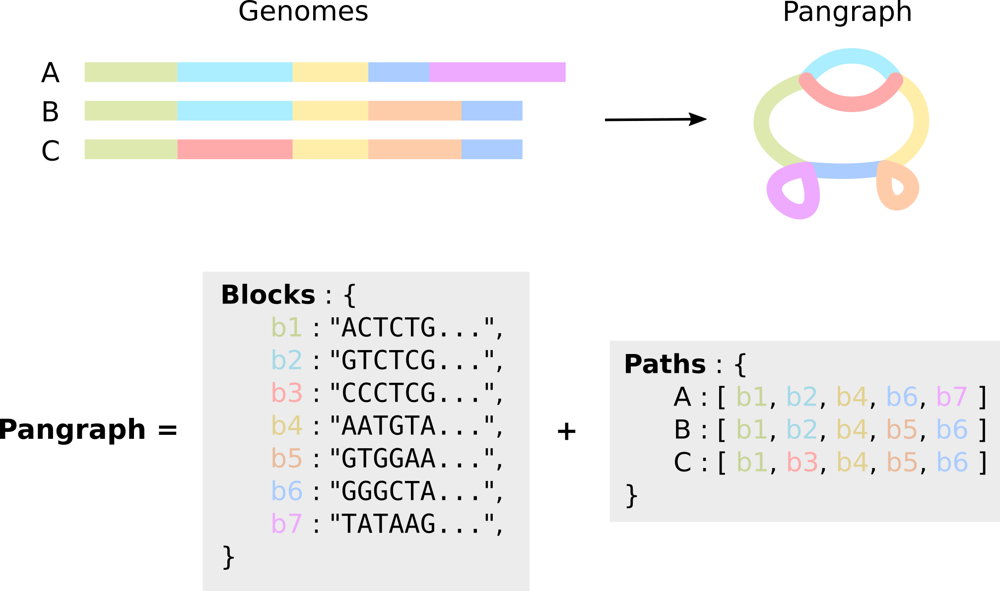
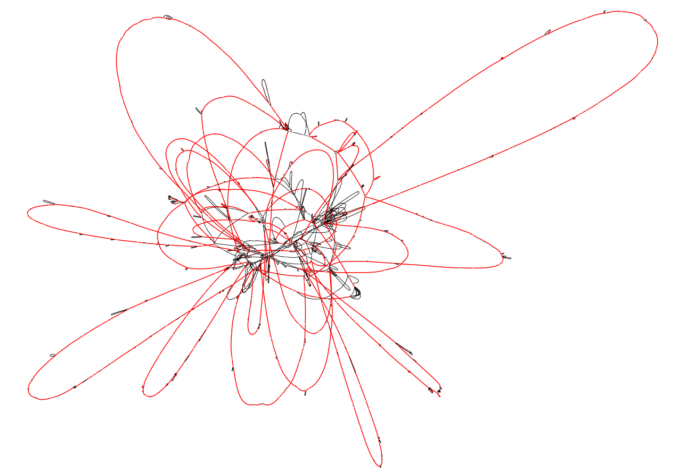

# Building a pangraph

This short tutorial will walk you through the process of generating a pangraph from a set of bacterial genomes. We will also cover how to export the generated pangraph file into other formats.

Simply put, a **pangenome graph** (or _pangraph_ for short) is a compressed representation of a set of genomes, in which alignable regions are saved as _blocks_ (or _pancontigs_) and genomes are represented as _paths_, i.e. list of blocks.



## Requirements

The tutorial requires you to have the `pangraph` command available in your path. Instructions on how to install pangraph can be found in [Installation](@ref).

For this tutorial we will use a small dataset containing full chromosomes of 10 _Escherichia Coli_ strains (source: GenBank). For convenience this dataset is available in the pangraph repository (`example_dataset/ecoli.fa.gz`), and can be downloaded with the command:

```bash
wget https://github.com/neherlab/pangraph/raw/master/example_datasets/ecoli.fa.gz
```

This is a single fasta file containing 10 fully assembled bacterial chromosomes, but no plasmids.
Note that it is not necessary for all of the data to be packed in a single fasta file. One can also pass multiple fasta files (optionally gzipped) as input to the command to build a pangraph.

## Building the pangraph

As a first step, we will build a pangraph object from the DNA of the 10 chromosomes.
This can be done using the command `build` (see [Build](@ref)):

```bash
pangraph build --circular ecoli.fa.gz > ecoli_pangraph.json
```
The option `--circular` is used when passing circular DNA sequences, like the bacterial chromosomes that we consider here.

On a consumer laptop the command should complete in around 10 minutes on 4 cores.

!!! note "multi-threaded execution"
    All pangraph commands are immediately parallelizable by setting the environment variable `JULIA_NUM_THREADS` _before_ running the build command.
    For example, to use 4 cores during the build command:
    ```bash
    export JULIA_NUM_THREADS=4
    ```

The result is a `ecoli_pangraph.json` file that contains two main entries: `paths` and `blocks`. As represented in the image above, blocks contain information on the nucleotide sequence, while paths are compressed representation for genomes as lists of blocks.
The `pangraph.json` contains all information in the input genomes, which can be reconstructed from the graph without loss.

Below is a simplified view of the structure of the `ecoli_pangraph.json` file.
```json
{
    "paths": [
        {
            "name": "NZ_CP010242",
            "blocks": [ { "id": "NFTNKNMFIC", ... }, { "id": "YTLSRRNNGL", ... }, ... ],
            ...
        },
        {
            "name": "NC_009800",
            "blocks": [  { "id": "AYYUXVXZXB", ... },  { "id": "YTLSRRNNGL", ... }, ... ],
            ...
        }
        ...
    ],
    "blocks": [
        { "id": "KZJIDOXBAV", "sequence": "AAGGTGGGTAATCATTTTGATAAGTGAT...", ... },
        { "id": "UOFDTEUSWC", "sequence": "GTTTTAATGCCAGCAAAAATGGTGAATT...", ... },
        ...
    ]
}
```

Each entry in `path` has two main properties: the `name`, corresponding to the sequence identifier in the input fasta file, and the `blocks` list. The latter is a representation of the genome as a list of blocks, each one identified by its unique `id`.

Each entry in the `blocks` lists corresponds to a different block. Each block is assigned an unique random id composed of 10 capital letters and the consensus `sequence` of the block.

More details on the structure of this `json` file will be covered in the next tutorial section.


### Sequence diversity and alignment sensitivity

As discussed in our [paper](https://neherlab.github.io/pangraph/#Citing-PanGraph), two variables control the maximum diversity of homologous sequences that are merged in the same block: the **sensitivity of the alignment kernel** and the **values of the pseudo-energy hyperparameters** $\alpha$ and $\beta$.

Pangraph can be run with two options for the alignment kernel:
- `-k minimap2`: uses the default minimap2 alignment kernel, with *asm10* option. This kernel find matches between sequences with up to 10% divergence. Sensitivity can be increased to 20% adding the option `-s 20`, which runs minimap with the *asm20* option. 
- `-k mmseqs`: uses [mmseqs2](https://github.com/soedinglab/MMseqs2) as alignment kernel. This is able to find matches on sequences with up to around 30% sequence divergence, at the cost of higher computational time.

Moreover, as explained in our [paper](https://neherlab.github.io/pangraph/#Citing-PanGraph) only matches with negative pseudo-energy are performed. The value of the pseudo-energy depends on two parameters:
- Parameter $\alpha$ (command line option `-a`) controls the cost of splitting a block into smaller units. Decreasing this costs results on average in a more fragmented graph, but with "deeper" alignments that contain more sequences.
- Parameter $\beta$ (command line option `-b`) controls the diversity cost. This is the cost associated to aligning sequences that are highly diverged. In particular, matches in which the pairwise diversity $d > 1 /\beta$ are discarded. Decreasing this cost allows merging of more diverged sequences. The default value $\beta=10$ sets a default sequence diversity threshold of 10%.

Therefore, **as a rule of thumb**:
- if the average pairwise diversity of homologous sequences in your sample is below 5%, running pangraph with option `-k minimap2 -s 20 -b 5` will results in most merges performed correctly.
- above this threshold, it is advised to use mmseqs2 as an alignment kernel, and optionally decreasing further the values of the energy hyperparameters `-k mmseqs -a 0 -b 0`.

Note that, depending on the kmer size (`-K` argument) mmseqs2 can require several Gb of available memory to run.

## Exporting the pangraph

The pangraph object can also be exported in other more common formats using the command `export` (see [Export](@ref)).

```bash
pangraph export \
    --no-duplications \
    --output-directory ecoli_export \
    ecoli_pangraph.json
```

This will create a folder named `ecoli_export` that contains two files.

- `pangraph.fa`: a fasta file containing the consensus sequence for each block.
- `pangraph.gfa`: a [Graphical Fragment Assembly](https://github.com/GFA-spec/GFA-spec) file that contains a representation of the pangenome graph structure.

The latter can be visualized using [Bandage](https://rrwick.github.io/Bandage/). The option `--no-duplications` causes the export function to avoid including duplicated blocks in the graph representation (they are instead exported as isolated blocks). In our experience this results in a less "tangled" visual representation. Below is how the Bandage visualization of this example pangraph looks like. Blocks are colored by frequency, with common blocks (appearing in many different chromosomes) in red and rare blocks (appearing in only a few chromosomes) in black.


