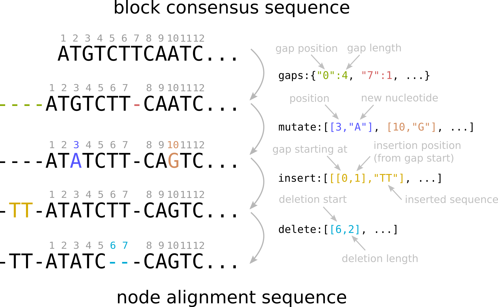
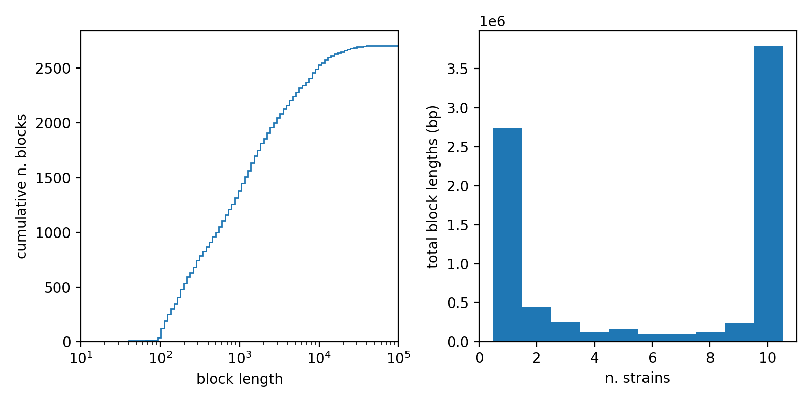

# The structure of Pangraph output file

In this second part of the tutorial we will explore more in details the content of the `json` output file produced by the `build` command, which contains all the information about the pangenome graph. This part of the tutorial is meant to provide instruments to access this information directly from this file.

As an example, we will use extracts from the `ecoli_pangraph.json` file that was produced in the previous section of the tutorial.

## The structure of `pangraph.json`

As discussed in the previous tutorial section, the two main entries of pangraph output file are `paths` and `blocks`. 

- each entry in the `paths` list encodes one of the nucleotide sequences that were given as input to the `build` command, represented as a list of blocks.
- each entry in the `blocks` list represents an alignable set of homologous sequences. A block contains the consensus of all of these sequences, together with information to reconstruct the full alignment.

We will explore each of these two categories separately.

## Blocks

Here is an example of an entry of the `blocks` list, from the `ecoli_pangraph.json` file.

```json
{
    "id": "TMEPNAOFAP",
    "sequence": "CGGGAAGGTTCTGATGCGTCCGTGTTAAACTAAGAGAATCTATCT...",
    "gaps": { ... },
    "mutate": [ ... ],
    "insert": [ ... ],
    "delete": [ ... ],
    "positions": [
        [
            { "name": "NZ_CP019944", "number": 1, "strand": true },
            [ 356656, 359732 ]
        ],
        [
            { "name": "NC_013361", "number": 1, "strand": false},
            [ 4496907, 4500032 ]
        ],
        [
            { "name": "NZ_CP015912", "number": 1, "strand": false},
            [ 2485802, 2488871 ]
        ],
        ...
    ]
},
```

The two main properties of a block are its unique `id` (10-letters alphabetic sequence randomly assigned when creating the pangraph), and the consensus `sequence`.

In addition to this, a block object also stores information on the full alignment of all the different occurrences of the block, and their position on the original input sequences. As explained in the [Introduction](@ref), we refer to a particular occurrence of a block in a sequence as a __Node__. Intuitively, they can be thought of as a single entry in the sequence alignment of a block.

Each node of a block can be uniquely identified by its "node-id", which is an object composed of three entries:
```json
{ "name": "NZ_CP019944", "number": 1, "strand": true }
```
- a `name`, indicating on which of the input sequences the node is found.
- a `number`, indicating whether this is the first, second, third... occurrence of a given block sequence. This is important to distinguish different nodes of a duplicated blocks, when they occurr in the same input sequence.
- a `strand` boolean value, indicating wheter the node is found on the forward (`true`) or reverse (`false`) strand.


The "node-id" is used for example in the `position` field of a block. This field contains information on the location of nodes on the input sequences. It consists of a list of pairs. The first entry of the pair is the node-id, indicating of which occurrence of the block the position is referred to. The seccond entry is a pair of numbers indicating the position of the beginning and end of the node on the input sequence.

In the example above, the first entry of `positions` indicates that block `"TMEPNAOFAP"` is found on the forward strand of the chromosome labeled `NZ_CP019944`, in positions `356656` to `359732`. Positions are always in 1-based numbering and referred to the forward strand (with beginning < end). The only exception is when a block wraps around the end of a circular sequence. In this case the beginning position (end of the genome) is higher than the end position.

The fields `gaps`, `mutate`, `insert` and `delete` contain information to reconstruct the block alignment. They were left out from the above example for simplicity, and are discussed in the next subsection.

## How alignments are encoded

A block object contains the information on the alignment of all the homologous sequences belonging to the block. This information is stored in compressed format in the `gaps`, `mutate`, `insert` and `delete` fields. In practice the alignment of each node sequence can be obtained from the consensus by adding the gaps, single-nucleotide mutations, and insertions / deletions contained in these fields.

Here we briefly describe each entry, and then schematically show how these can be combined to obtain the alignment sequence of a node.

!!! note "reconstructing the alignments"
    Rather than providing explicit instructions on how to build the alignments, the aim of this part of the tutorial is to show how the information is organized in the pangraph output format. For a quick way to obtain block alignments, one can refer to the next tutorial section [Polishing the pangraph and exploring alignments](@ref).

### Gaps

the `gaps` entry contains a json object that indicates where gaps should be added to the consensus sequence as a first step towards reconstructing the alignment. The first item represents the position of the gap, and the second its length.

```json
"gaps" : {"0": 27, "53": 1 }
```

In this example the consensus sequence contains two gaps: one at the beginning with length 27, and one after sequence position 53, with length 1.

### Single-nucleotide mutations

The `mutate` entry encodes single-nucleotide mutations. It contains a list of pairs. Each pair is relative to a particular node (i.e. one line in the alignment) and the first item of the pair is the node-id described above. The second entry is a list of mutations (potentially empty). Each mutation is specified by its position on the original sequence, and the nucleotide that should be substituted.

```json
"mutate" : [
    [
        { "name": "NC_009800", "number": 1, "strand": false },     // node-id
        [ [415,"C"], [1526,"T"], [2827,"G"], ... ]                 // list of mutations
    ],
    [
        { "name": "NZ_CP011342", "number": 1, "strand": false },   // node-id
        [ [2221, "G"], [415, "C"], [2494, "T"], [1825, "A"], ... ] // list of mutations
    ],
    [
        { "name": "NZ_CP019944", "number": 1, "strand": true },    // node-id
        [ [2827, "G"], [442, "T"], [2713, "G"], ... ]              // list of mutations
    ],
    ...
],
```

### Insertions and deletions

Entries of `insert` and `delete` are organized similarly to mutations. They appear in lists of pairs, whose first item is the node-id, and the second is the list of insertions/deletions that one needs to include. This list can potentially be empty.

```json
"insert" : [
    [
        { "name": "NC_009800", "number": 1, "strand": false },
        []
    ],
    [
        { "name": "NZ_CP011342", "number": 1, "strand": false },
        []
    ],
    [
        { "name": "NZ_CP019944", "number": 1, "strand": true },
        [ [ [0,0], "TT"], [ [0,15], "TTCCC"] ]
    ],
    ...
],
```

Insertions are always operated inside of gaps. They appear in the form `[ [gap-beg, gap-offset], "seq"]`. The `gap-beg` indicates the beginning position of the gap, and `gap-offset` indicate how far from the beginning of this gap the insertion should be added. Finally `seq` is the nucleotide sequence to be inserted.

```json
"delete" : [
    [
        { "name": "NC_009800", "number": 1, "strand": false },
        [ [ 3071, 56 ] ]
    ],
    [
        { "name": "NZ_CP011342", "number": 1, "strand": false },
        []
    ],
    [
        { "name": "NZ_CP019944", "number": 1, "strand": true },
        [ [ 3071, 56 ] ]
    ],
    ...
],
```

Deletions are instead in the form `[del-beg, del-lengh]` where the first number indicates the position at which the deletion starts (relative to the consensus sequence) and the second is the deletion length.

### From block consensus to node alignment

Below is a schematic summary of how gaps, mutations, insertions and deletions can be combined to go from the block consensus sequence to the alignment sequence of a particular node. 




## Paths

A path object has the following structure:

```json
{
    "name": "NZ_CP010242",
    "offset": -3044650,
    "circular": true,
    "position": [ 1695501, 1696243, 1702666, ... ],
    "blocks": [
        { "id": "IUZTZPLBVS", "name": "NZ_CP010242", "number": 1, "strand": true },
        { "id": "DVEJPZTOYJ", "name": "NZ_CP010242", "number": 1, "strand": true },
        { "id": "FUECJYRQOZ", "name": "NZ_CP010242", "number": 1, "strand": true },
        ...
    ]
},
```

The two main properties of a path are `name` and `blocks`. The `name` of the path indicates to which of the input sequences the path represents. `blocks` contains the ordered list of nodes that make up the path. Each node is identified by the unique block `id`, and by the entries of the node-id (`name`, `number`, `strand`).

Here is a complete list containing a description of every entry in the path object:

- `name` : the name of the particular nucleotide sequence to whom the path refers. This name is extracted from the sequence id in the input fasta file.
- `circular` : indicates whether the considered sequence is circular (e.g. plasmid) or not. This is controlled by the `--circular` option of the build command.
- `blocks` : the ordered list of blocks that make up the path.
    - `id` : the unique random id of the block, assigned when building the graph.
    - `name`, `number` `strand` : entries of the node-id, used to identify which particular instance of the block is part of the path. As a reminder, `name` is the id of the input sequence, `number` indicates which occurrence of the same block is considered (useful for duplicated blocks) and `strand` indicates whether the sequence is found on the forward or reverse strand. 
- `position` : an ordered list of positions, corresponding to the beginning positions of each block in the path.
- `offset` : indicates the distance between the beginning of the input sequence, and the beginning of the path (i.e. the beginning of the first node of the path, block `IUZTZPLBVS` in the example above).  


## A look at the length and frequency of blocks

Having completed this part of the tutorial, it is now possible to access directly the rich information contained in the pangraph output format.

As a simple example, we take the `ecoli_pangraph.json` file and extract from each block the length of its consensus sequence, and the number of unique E.Coli strains that contain the block. We then plot the cumulative distribution of block lengths, and the frequency distribution of blocks (weighted by length).



The blocks present in our pangraph have wide varying size, with some blocks being only some hundreds of nucleotides long, and others spanning tens of kbps.[^1]

[^1]: The almost complete absence of blocks shorter than 100 bps depends on the standard value of the `--len` option in the `build` command, which is set to 100. See [Build](@ref).

The block frequency distribution shows a typical bimodal pattern, with an abundance of "core" blocks (blocks that are present in all the 10 considered chromosomes, cumulative length of more than 3.5 Mbps) and rare blocks present in only one strain (cumulative length of more than 2.5 Mbps).