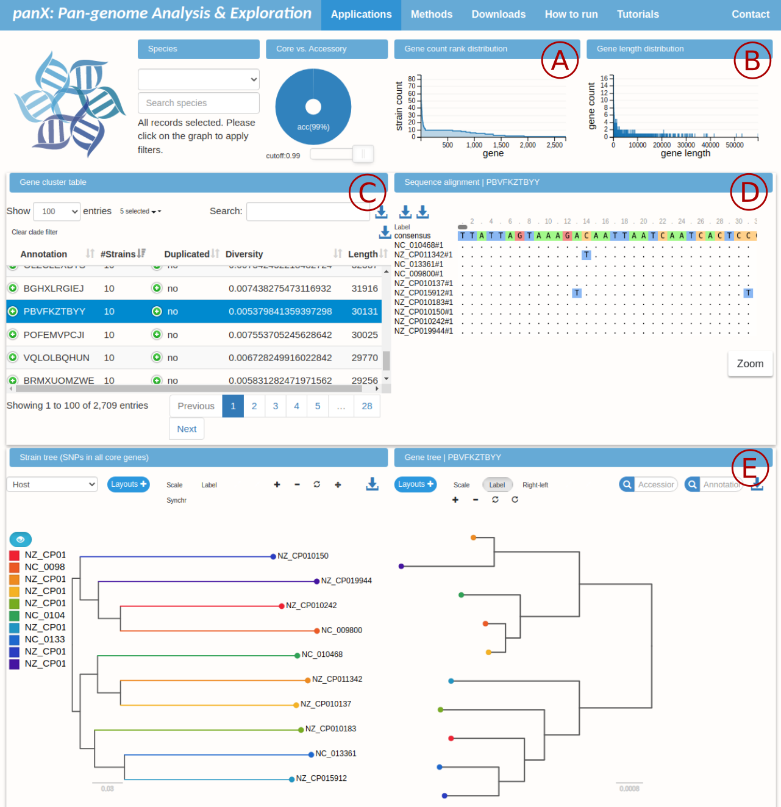

# Polishing the pangraph and exploring alignments

This third tutorial is focused on block alignments and is divided in three main parts:
- refining the block alignments using the `polish` command.
- exporting the alignment (and related phylogenetic tree) of each block.
- exploring the full set of block alignments using the [panX](https://pangenome.org/)[^1] visualization.

[^1]: Ding, Wei, Franz Baumdicker, and Richard A. Neher. "panX: pan-genome analysis and exploration." Nucleic acids research 46.1 (2018): e5-e5.

!!! note "Requirements"
    Exporting files for the panX visualization requires [fasttree](http://www.microbesonline.org/fasttree). Running the panX visualization requires instead [node.js](https://nodejs.org/en/).

## Polishing the alignments

The pangenome graph is built by iterative pairwise merges of smaller graphs along a guide tree. At each stage blocks are compared and aligned using only their _consensus_. This shortens considerably the time needed to build a pangraph, but might introduce minor inconsistencies and artifacts in the alignments. These can be removed using the `polish` command (see [Polish](@ref)).

To polish the `ecoli_pangraph.json` file that was produced in the first tutorial we can run the command:

```bash
pangraph polish ecoli_pangraph.json > polished_pangraph.json
```

This should complete in 10/15 minutes on a consumer laptop. Optionally, a threshold length can be specified with the flag `--length`. In this case only blocks shorter than this threshold are refined.

Notice that the only effect of this command is refining the alignments, but the "topological" structure of the pangraph is left otherwise unchanged. As such, this command 

## Export block alignments and trees

By running the `export` command with the `--export-panX` option (see [Export](@ref)) one can export all the block alignments, together with additional files that are needed for the panX visualization. For our example we can run:

```bash
pangraph export \
    --export-panX \
    --output-directory ecoli_export \
    --no-export-gfa \
    polished_pangraph.json
```

The flag `--no-export-gfa` excludes the export in gfa format that we covered in the first tutorial. This command should run in about 15 minutes. It will generate a folder named `ecoli_export/vis` that contain multiple files. These include:
- the alignment of each block (`geneCluster/*_aln.fa.gz` files)
- the phylogenetic tree generated from each alignment (`geneCluster/*.nwk` files)
- the phylogenetic tree obtained from the concatenated alignment of all core blocks (`strain_tree.nwk`)
- additional files needed for the panX visualization


## Accessing block alignments and trees

The file `geneCluster.json` contains the index of all block alignments. It consists of a list with one entry per block. Here is an example of an entry:

```json
{
    "GName": "none",
    "geneLen": 114,       // length of block in bp
    "dup_detail": "",
    "geneId": 1129,
    "allGName": "none",
    "count": 5,           // tot n. of block occurrences
    "locus": [            // list of "strain # node number"
        "NZ_CP010150#1",
        "NZ_CP010183#1",
        "NZ_CP015912#1",
        "NC_013361#1",
        "NZ_CP019944#1"
    ],
    "msa": "RC00001129",  // Id assigned to the alignment.
    "divers": 0.03508771929824561,
    "ann": "SXSJVKIOIY",  // block id
    "dupli": "no",        // whether the block is duplicated in some strains
    "allAnn": "SXSJVKIOIY"
},
```

The most important properties of this object are:[^2]
- `ann`: block id.
- `msa`: id assigned to the block alignment by the export function. This is the prefix of the corresponding alignment file.
- `geneLen`: length of the consensus sequence of the block.
- `count`: total number of occurrences of the block.
- `locus`: list of block occurrences (nodes). Each one is labeled as "strain # node number".
- `dupli`: whether the block is duplicated in some strain.

[^2]: The names of these entries was assigned so as to be compatible with the panX visualization, which uses genes instead of blocks. This is why for example the length is saved as `geneLen`, even though the pangenome graph and blocks do not contain gene annotations.

In particular, the `msa` property provides the prefix of the file containing the block alignment and the phylogenetic tree. In the example above, the nucleotide alignment for block `SXSJVKIOIY` can be found in file `geneCluster/RC00001129_na_aln.fa.gz`, and the corresponding phylogenetic tree is `RC00001129.nwk`.


## Explore block alignments with the panX visualization

This export format was designed to be compatible with the [panX visualization](https://github.com/neherlab/pan-genome-visualization). This visualization was originally created for gene clusters, but it is equally informative if one uses block alignments instead of gene alignments. The repository contains instructions on how to set up the visualization.

For our example we need to:
- clone the repository and perform the setup
- add a new page to the visualization for our example data
- copy the export file we previously created into the apposite folder
- start the server

this can be done with the command:

```bash
# clone the repository, access it and install packages
git clone https://github.com/neherlab/pan-genome-visualization 
cd pan-genome-visualization
git submodule update --init
npm install

# add a new page for our dataset named Ecoli, with wide format
bash add-new-pages-repo.sh Ecoli wide

# copy the content of the vis folder in to
cp -r ../ecoli_export/vis/* public/dataset/Ecoli/

# start the server
npm start
```

Once the server has started, the visualization can be accessed at <http://localhost:8000/Ecoli>.



Here is a summary of the information displayed in different panels:

- A: rank plot of block counts. The initial peak is represented by duplicated blocks (more than 10 counts). Core blocks are found in the plateau at count equal to 10. Rare blocks populate the tail of the plot.
- B: distribution of block lengths. The longest blocks in our example have length of more than 50 kbps.
- C: table relating block id (`annotation`) to number of counts (`#Strains`), whether the block is duplicated, average diversity, and length of the consensus sequence in basepairs.
- D: visualization of the block alignment for the block selected in panel C. Entries are labeled according to the strain and the number of block occurrence.
- E: comparison of the core-block tree (left, phylogenetic tree constructed from the concatenated alignment of all core blocks) and the tree reconstructed from the alignment selected in panel C (right).


