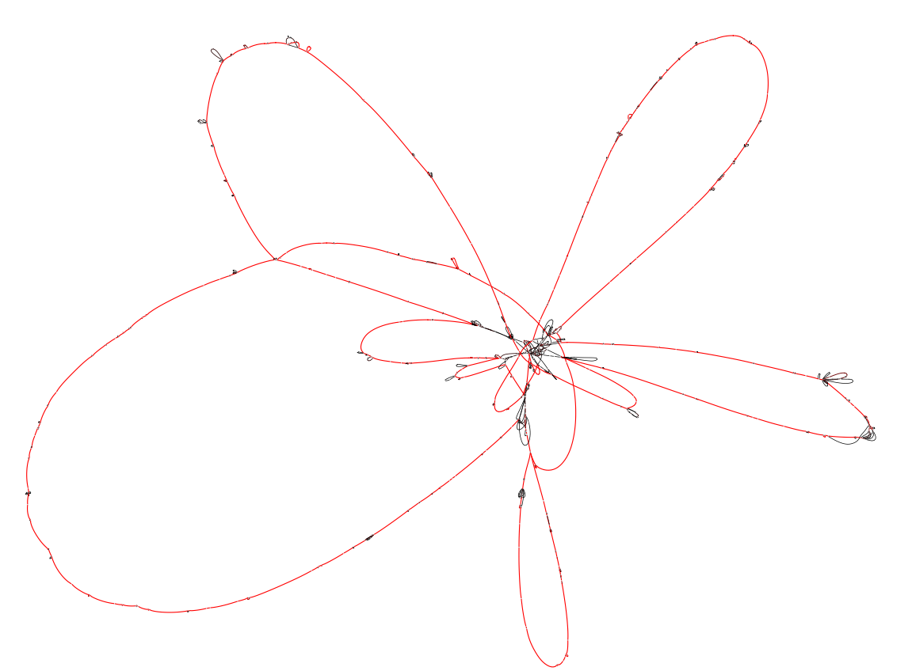
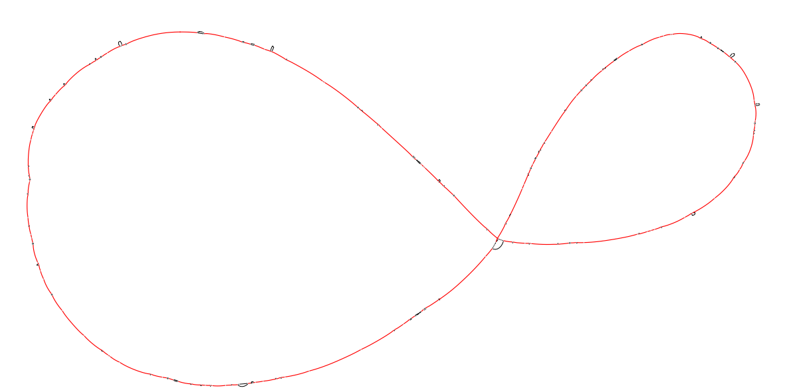
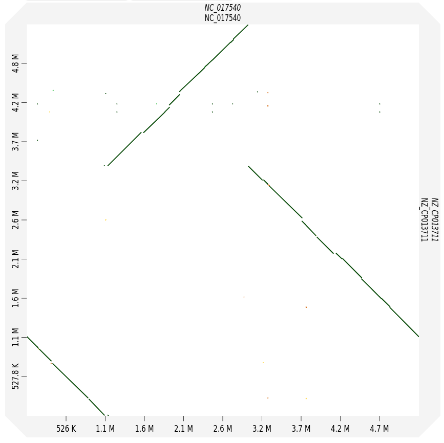

# Projecting the graph on a subset of strains.

In this final part of the tutorial we show how to use the `marginalize` command. This command can be used to quickly extract a smaller pangraph for a subset of strains from the pangraph of the full set of strains.

- aim of the tutorial: show the marginalize command
- test on a different dataset: klebsiella. Download data (chromosomes) and generate the pangraph.
- project on a subset of strains that are more similar. This removes transitive edges.
- visualize with bandage full graph vs pairwise comparison. (show a dotplot to see the common part?)

Klebs link: https://github.com/nnoll/pangraph/blob/feat/example-dataset/example_datasets/klebs.fa.gz

## Preliminary steps

- Download data and build the pangraph

```bash
wget https://github.com/nnoll/pangraph/raw/feat/example-dataset/example_datasets/klebs.fa.gz
```

```bash
pangraph build --circular klebs.fa.gz > klebs_pangraph.json
```

## Marginalize the graph on a subset of strains

- explain the various options with the command

```bash
pangraph marginalize \
    --strains NZ_CP013711,NC_017540 \
    klebs_pangraph.json > klebs_marginal.json
```


## Export and visualize with bandage. Comparison with full graph

- show the bandage output and interpret it.

```bash
pangraph export \
    --no-duplications \
    --output-directory klebs_export \
    --prefix full_klebs \
    klebs_pangraph.json

pangraph export \
    --no-duplications \
    --output-directory klebs_export \
    --prefix marginal_klebs \
    klebs_marginal.json
```






