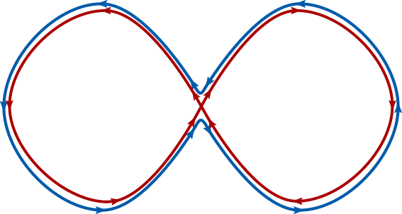

# Projecting the graph on a subset of strains.

In this final part of the tutorial we show how to use the `marginalize` command. This command is used when one is interested in the relationship between a subset of the genomes that make up the pangraph. It can quickly create, starting from the full pangraph, a smaller pangenome graph relative to the selected subset of strains.


## Preliminary steps

We will run this tutorial on a different dataset, containing 10 complete chromosomes of _Klebsiella Pneumoniae_ (source: GenBank). These sequences are available in the pangraph repository (`example_dataset/klebs.fa.gz`) and can be downloaded by running:

```bash
wget https://github.com/neherlab/pangraph/raw/master/example_datasets/klebs.fa.gz
```

As for the previous dataset, we can create the pangraph with the command:

```bash
pangraph build --circular klebs.fa.gz > klebs_pangraph.json
```

On 4 cores the command should complete in around 6 mins. After creating the pangraph, we can export it in `gfa` format for visualization.

```bash
pangraph export \
    --no-duplications \
    --output-directory klebs_export \
    --prefix klebs_pangraph \
    klebs_pangraph.json
```

This will create the file `klebs_export/klebs_pangraph.gfa` which can be visualized using [Bandage](https://rrwick.github.io/Bandage/).


Colors indicate the number of times a block occurs. Blocks that appear in red are core blocks that are found in every chromosome, while black blocks are only present in a few strains. We used the `--no-duplication` flag in the export command, which excludes duplicated blocks from the exported graph. This simplifies the visualization, which would otherwise be highly "tangled-up" by these duplications.

## Marginalize the graph on a subset of strains

The full graph might be difficult to interpret. However if we are interested only in relationships between a subset of chromosomes we can use the command `marginalize` (see [Marginalize](@ref)) to project the pangraph on this set of strains. This "marginalization" operation will remove _transitive edges_. If two blocks always come one after the other (with same strandedness) in all of the subset of strains one is interested in, these blocks will be merged in a new larger block. This can greatly simplify the pangenome graph, and highlight differences between a particular subset of strains. And it is also computationally much faster than building a new pangraph directly from the sequences of interest.

For this example we will consider the pair of strains `NZ_CP013711` and `NC_017540`.[^1] We can marginalize the pangraph on these two strains by running:

[^1]: here we consider a marginalization on two strains, but one can marginalize the pangraph on any number of strains.


```bash
pangraph marginalize \
    --strains NZ_CP013711,NC_017540 \
    klebs_pangraph.json > klebs_marginal_pangraph.json
```

The file `klebs_marginal_pangraph.json` will contain the new marginalized pangraph. The strains on which one projects are specified with the flag `--strains`. They must be passed as a comma separated list of sequence ids, without spaces.

!!! note "producing all pairwise marginalizations"
    If the command `marginalize` is executed without specifying particular strains, but providing an output directory with the option `--output-path`, then it will automatically produce all pairwise marginalizations and save them in the specified directory.

## A look at the marginalized pangraph

As done for the main pangraph, we can export the marginalized pangraph in `gfa` format:

```bash
pangraph export \
    --no-duplications \
    --output-directory klebs_export \
    --prefix klebs_marginal_pangraph \
    klebs_marginal_pangraph.json
```

This will produce the file `klebs_export/klebs_marginal_pangraph.gfa` which can be visualized with Bandage.


As expected the marginalized pangraph contains fewer blocks than the original one (388 vs 1244), and blocks are on average longer (mean length: 14 kbp vs 6 kbp). Blocks that appear in red are shared by both strains, while black blocks are present in only one of the two strains. The pangraph is composed of two stretches of syntenic blocks, which are in contact in a central point. This structure can be understood by comparing the two chromosomes with a dotplot. Using [D-Genies](http://dgenies.toulouse.inra.fr/) on the two sequences[^2] we obtain the following:

[^2]: to simplify the visualization, the chromosome of strain `NZ_CP013711` was reverse-complemented and shifted of ~ 0.1 Mbp, so that most of the matches lay on the diagonal.


The contact point between the two loops in the pangraph is caused by the fact that the two genomes are composed of two mostly syntenic subsequences (the two loops) but these loops are concatenated with two different strandedness in the two strains. If we were to draw the two paths (relative to the two chromosomes) with different colors on top of the pangraph we would observe something similar to this:


