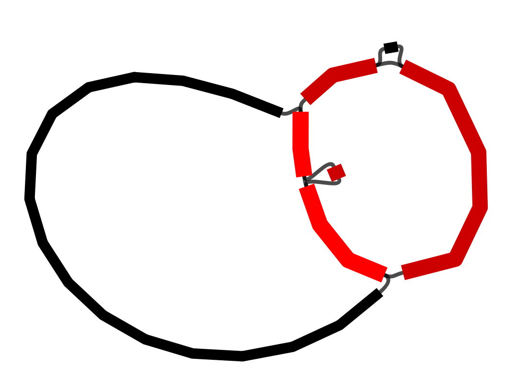
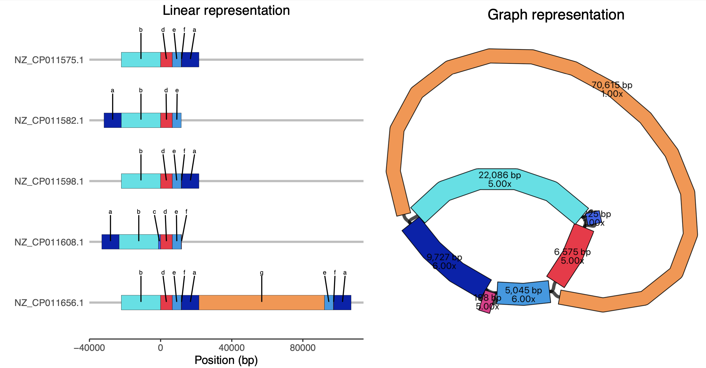

# Example application: plasmid rearrangements

These next two tutorials cover other possible applications of pangraph and processing the downstream output.

Although pangraph was developed with whole genomes in mind, it can be applied to other situations. In this tutorial, we will explore the structural diversity in some closely-related plasmids from a hospital outbreak. Pangraph can be applied to these 'as if' they were whole genomes.  

## Preliminary steps

This tutorial uses a dataset of five closely-related plasmids. They were analysed previously by Sheppard et al. (2016) in a [paper](https://doi.org/10.1128/AAC.00464-16) studying an outbreak of carbapenem-resistant bacteria in a hospital in Virginia, USA. These plasmids are all similar to an [index plasmid](https://www.ncbi.nlm.nih.gov/nuccore/CP017937.1) from the hospital, but have some structural changes. We will show how pangraph output can be used to visualize this structural diversity.

You can download these sequences by running:

```bash
wget https://github.com/liampshaw/pangraph-tutorials/raw/main/data/sheppard/UVA01_plasmids.fa.gz
```

Building the pangraph and exporting it for visualization is done with these commands (should be very quick as we are using plasmids, which are much smaller than whole genomes):

```bash
pangraph build --circular UVA01_plasmids.fa.gz > UVA01_plasmids_pangraph.json
pangraph export --edge-minimum-length 0 UVA01_plasmids_pangraph.json -p UVA01_plasmids_pangraph -o ./
```

We use `--edge-minimum-length 0` because we want to see all blocks.

## Default visualization

As before, we can visualize the output file `UVA01_plasmids_pangraph.gfa` with [Bandage](https://rrwick.github.io/Bandage/).



Here, the node colour represents the depth of the blocks. However, it is difficult from this visualization to understand individual paths through the graph.

## Improving the visualization

We can use some custom scripts to look at representations of the plasmids alongside their pangraph. These scripts are not part of pangraph but are an example of how to process the output into visualizations. You can download them by running:

```bash
wget https://raw.githubusercontent.com/liampshaw/pangraph-tutorials/main/scripts/prepare-pangraph-gfa.py
wget https://raw.githubusercontent.com/liampshaw/pangraph-tutorials/main/scripts/plot-blocks-UVA01.R
```

First, we run a script to generate random colours for the blocks.

```bash
python prepare-pangraph-gfa.py UVA01_plasmids.pangraph.gfa --all
```

This produces three files:
* `${input}.blocks.csv` - dataset of genome and block start/end positions, with block colours (hex codes)
* `${input}.colours.csv` - blocks with colours (hex codes). The `--all` flag in the python script means we give all blocks a colour, even those which only appear once.
* `${input}.coloured.gfa` - a gfa with the same block colours added as an extra field

Then we call Bandage programmaticaly with the `custom` colours option on the coloured gfa:

```bash
Bandage image UVA01_plasmids_pangraph.gfa.coloured.gfa pangraph.png --height 2000 --width 2500 --colour custom --depth --lengths --fontsize 30 --nodewidth 8
```

We can now look at a linear representation of the plasmids alongside this graph. The details are in the script, but we basically represent the plasmids linearly and choose a random block to 'anchor' them all to the same place.  

```bash
Rscript plot-blocks-UVA01.R UVA01_plasmids_pangraph.gfa.blocks.csv pangraph.png pangraph_linear_vs_graph.pdf
```

This produces a version[^1] where we can see the different 'walks' taken through the graph by each plasmid. For ease of understanding, on the left-hand side we have added simplified labels of the blocks (a-f) since some of the blocks are very small and hard to make out otherwise.



Note that the plasmids are circular: in the linear representation, in two cases block 'a' appears on the left rather than on the right, but the structure is identical.

[^1]: your version will probably be different due to the random layout chosen by Bandage. You can always rerun the Bandage command multiple times until you get a nice result.

Sheppard et al. previously analysed these plasmids and made a table of the structural changes they identified with respect to the reference plasmid (Table 1 in their [paper](https://doi.org/10.1128/AAC.00464-16)). We can see that the structural changes they identified are interpretable from the visualization we have made:


| Accession      | Species         | Date     | Length (bp) | Structural differences (Sheppard)             | Corresponding block(s) (pangraph) |
| -------------- | --------------- | -------- | ----------- | --------------------------------------------- | --------------------------------- |
| NZ\_CP011575.1 | _K. pneumoniae_ | Mar-2011 | 43,621      |                                               |                                   |
| NZ\_CP011582.1 | _E. cloacae_    | Aug-2012 | 43,433      | 188-bp deletion                               | `f`                               |
| NZ\_CP011598.1 | _K. intermedia_ | Sep-2009 | 43,621      |                                               |                                   |
| NZ\_CP011608.1 | _C. freundii_   | Nov-2010 | 44,846      | 1,225-bp insertion                            | `c`                               |
| NZ\_CP011656.1 | _C. freundii_   | Oct-2012 | 129,196     | 14,960-bp duplication and 70,615-bp insertion | `e,f,a`[^2] and `g`               |


[^2]: The 14,960-bp duplication is represented as a repetition of `e,f,a` in the bottom plasmid. The total length is `5,045+188+9,727=14,960` as expected.
