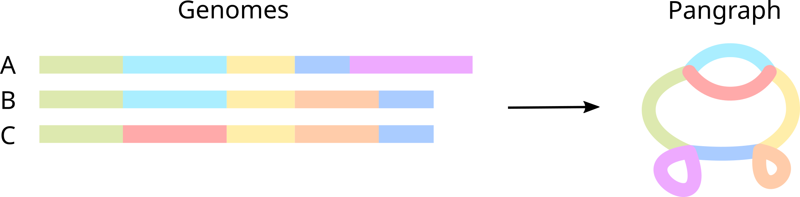
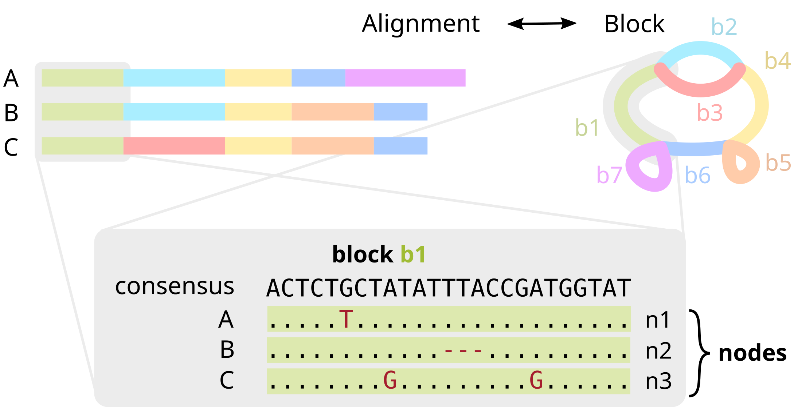
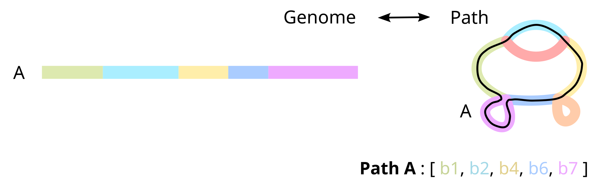

# PyPangraph

!!! warning

    This documentation is currently under development. If you run into any issues, don't hesitate to open an issue on the [GitHub repository](TODO).

PyPangraph is a Python library for loading, exploring and analyzing **pangenome graphs** created by [PanGraph](https://github.com/neherlab/pangraph).

More details on this data structure and the algorithms used to build it can be found in [PanGraph's documentation](TODO) and the [paper](index.md#pangraph-paper-citation)

## Tutorials

This documentation contains a series of tutorials to showcase the main features of PyPangraph:

- [Load and explore a graph](tutorial1.md)
- [A look at the pangenome](tutorial2.md)
- [Exploring block alignments](tutorial3.md)
- [Paths and core-genome synteny](tutorial4.md)

Other than PyPangraph, other python packages are used in the examples of the tutorial. They can be installed via [conda](https://docs.conda.io/en/latest/) with:

```bash
conda install -c conda-forge -c bioconda biopython pandas matplotlib seaborn scikit-learn
```

## What is a Pangenome Graph?

Simply put, a **pangenome graph** (or _pangraph_ for short) is a compressed representation of a set of genomes, in which alignable regions are saved as _blocks_ (or _pancontigs_) and genomes are represented as _paths_, i.e. list of blocks.



In more detail, **blocks** encode multiple sequence alignments of homologous parts of the sequence. Each block has a _consensus sequence_, but also stores variations (SNPs, insertions, deletions) for each particular occurrence of the block in the genome. We refer to each occurrence as a **node**.



Once genome have been partitioned into separate blocks, each genome can be represented as a walk through the blocks, named a **path**.



More specifically, a path is encoded as a list of oriented block occurrences, i.e. **nodes**. This preserves information on the strandedness of each segment, and on the mutations in each genome, and makes our representation **lossless**: we can reconstruct the original genomes exactly from the pangraph.

## PanGraph paper citation

_PanGraph: scalable bacterial pan-genome graph construction_ Nicholas Noll, Marco Molari, Liam P. Shaw, Richard Neher _Microbial Genomics_ 9.6 (2023); doi: [https://doi.org/10.1099/mgen.0.001034](https://doi.org/10.1099/mgen.0.001034)